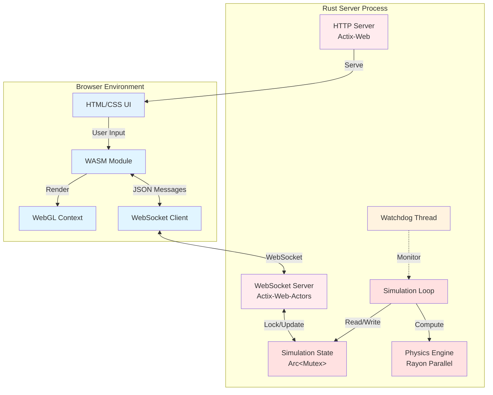
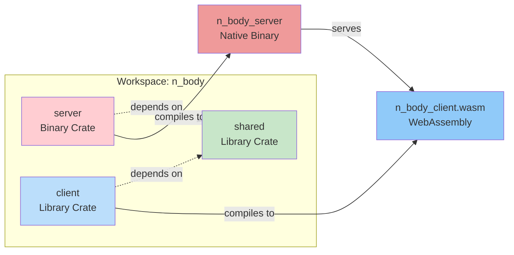
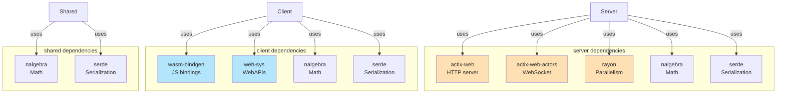
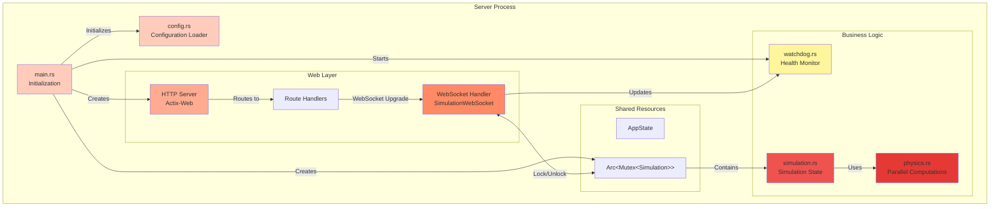
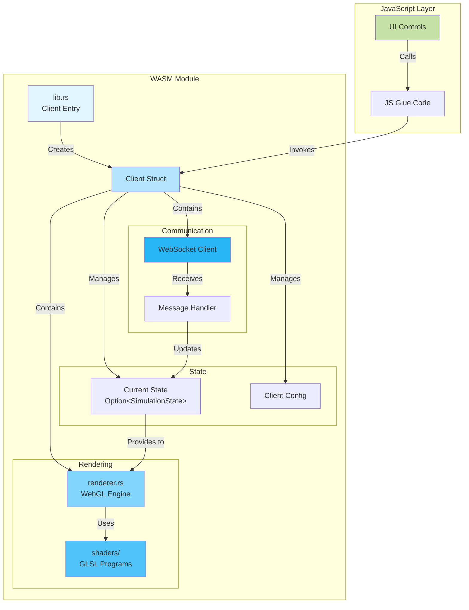
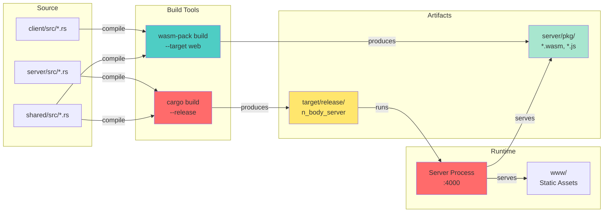
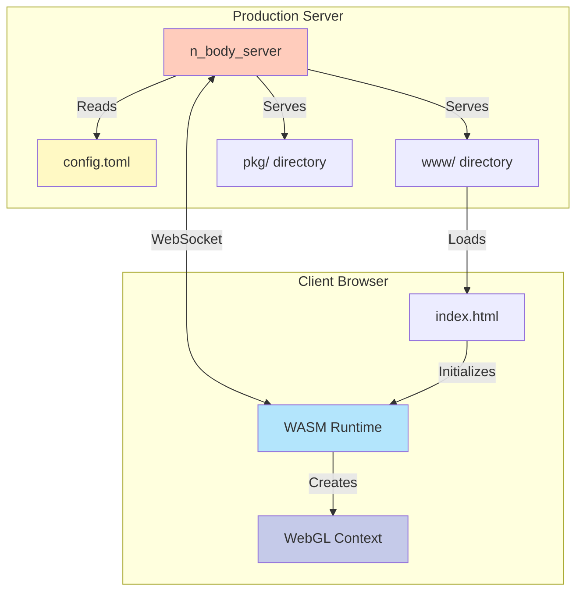
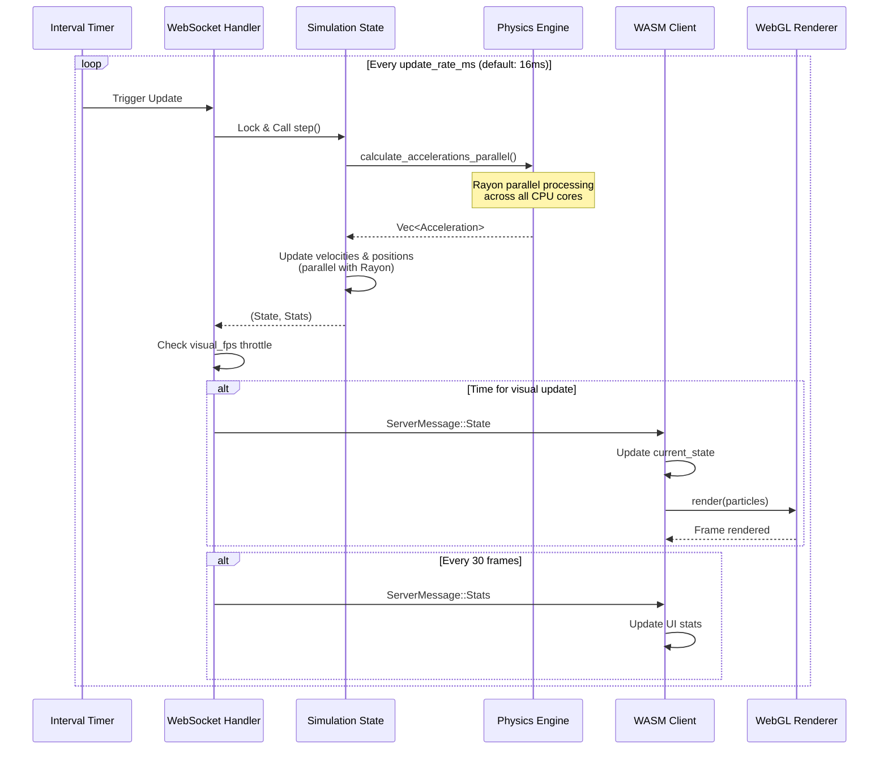
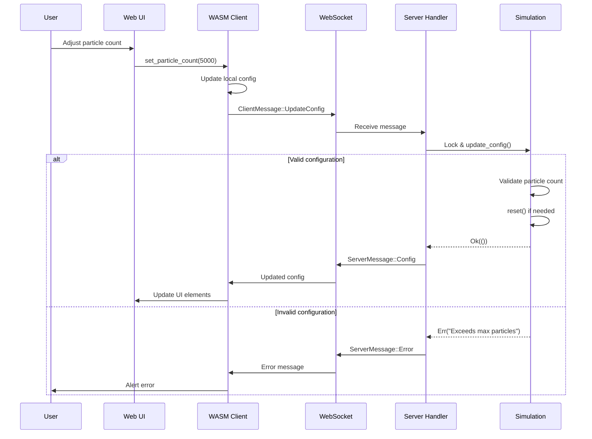
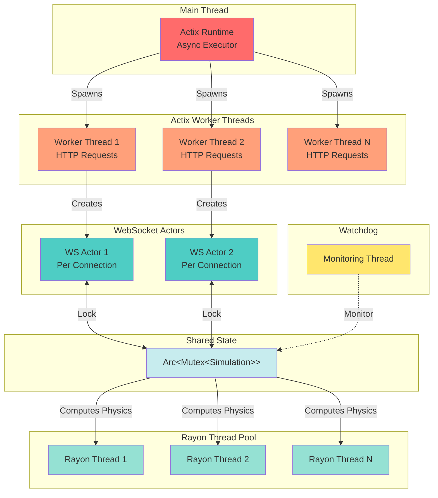

# Architecture Overview

This page provides a comprehensive view of the N-Body simulation's architecture, including system design, component interactions, and data flow.

## Table of Contents
- [High-Level Architecture](#high-level-architecture)
- [Workspace Structure](#workspace-structure)
- [Component Architecture](#component-architecture)
- [Deployment Architecture](#deployment-architecture)
- [Data Flow](#data-flow)

## High-Level Architecture

The system follows a client-server architecture with clear separation of concerns:



### Key Design Principles

1. **Server-Authoritative Physics**: All physics computations happen on the server for consistency
2. **Client Rendering Only**: Client receives state updates and renders them
3. **Lock-Based Concurrency**: Simulation state protected by `Arc<Mutex<T>>`
4. **Parallel Physics**: Rayon parallelizes O(n²) force calculations across CPU cores
5. **Throttled Updates**: Visual FPS setting reduces network traffic

## Workspace Structure

The project is organized as a Rust workspace with three interdependent crates:



### Crate Dependencies



## Component Architecture

### Server Components



### Client Components



## Deployment Architecture

### Build Process Flow



### Runtime Deployment



## Data Flow

### Simulation Update Cycle



### Configuration Update Flow



## Concurrency Model

### Thread Architecture



## Performance Considerations

### Computational Complexity

| Component | Complexity | Notes |
|-----------|------------|-------|
| Physics Calculation | O(n²) | All pairs of particles |
| Parallel Speedup | ~O(n²/c) | c = number of CPU cores |
| State Serialization | O(n) | Linear in particle count |
| Rendering | O(n) | One vertex per particle |
| WebSocket Transfer | O(n) | Network bandwidth limited |

### Bottleneck Analysis

```mermaid
graph LR
    subgraph "Performance Bottlenecks"
        CPU[CPU: Physics O(n²)<br/>Dominant at high particle counts]
        Network[Network: State Transfer<br/>Minimal due to throttling]
        GPU[GPU: WebGL Rendering<br/>Rarely bottlenecks]
        Memory[Memory: State Clone<br/>O(n) per frame]
    end

    ParticleCount[Particle Count]

    ParticleCount -->|Quadratic Impact| CPU
    ParticleCount -->|Linear Impact| Network
    ParticleCount -->|Linear Impact| GPU
    ParticleCount -->|Linear Impact| Memory

    style CPU fill:#ff6b6b
    style Network fill:#4ecdc4
    style GPU fill:#95e1d3
    style Memory fill:#ffe66d
    style ParticleCount fill:#c7ecee
```

## Related Pages

- **[Communication Protocol](Communication-Protocol)** - Detailed message protocol
- **[Server Components](Server-Components)** - Deep dive into server architecture
- **[Client Components](Client-Components)** - Deep dive into client architecture
- **[Performance Tuning](Performance-Tuning)** - Optimization strategies

---

[← Back to Home](Home)
