# Client Components

Detailed documentation of the WebAssembly client architecture, including rendering, WebSocket communication, and browser integration.

## Table of Contents
- [Overview](#overview)
- [Architecture](#architecture)
- [Core Modules](#core-modules)
- [WebGL Rendering](#webgl-rendering)
- [Browser Integration](#browser-integration)

## Overview

The client is a Rust library compiled to **WebAssembly** (WASM) that runs in the browser. It handles:
- WebSocket communication with the server
- WebGL-based particle rendering
- User input processing
- State management

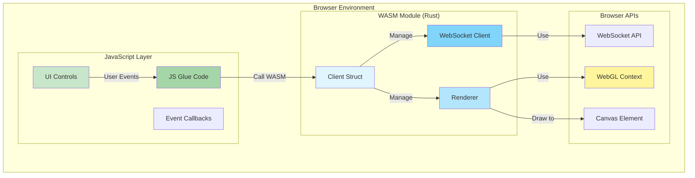

## Architecture

### Module Structure

```
client/
├── src/
│   ├── lib.rs           # Client entry point and WebSocket handling
│   ├── renderer.rs      # WebGL rendering engine
│   └── shaders/
│       ├── vertex.glsl      # Vertex shader
│       └── fragment.glsl    # Fragment shader
├── Cargo.toml           # Dependencies and build config
└── pkg/                 # Build output (generated by wasm-pack)
    ├── n_body_client_bg.wasm
    ├── n_body_client.js
    └── ...
```

### Component Diagram

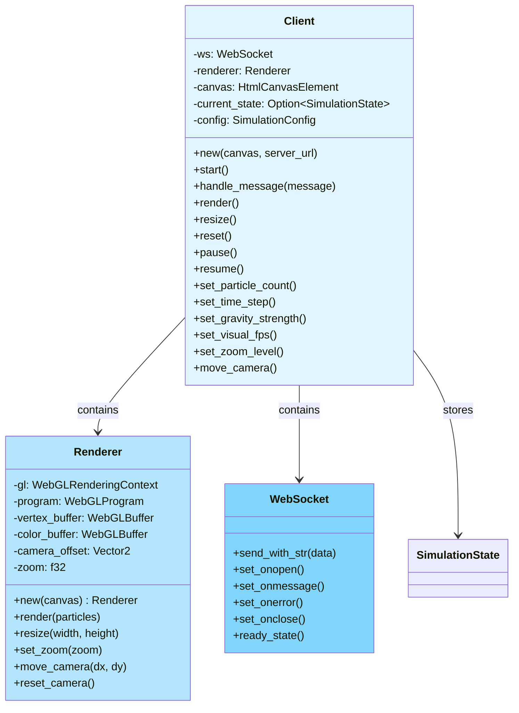

## Core Modules

### lib.rs - Client Entry Point

**Purpose**: Main client struct, WebSocket handling, and state management.

**Client Lifecycle:**

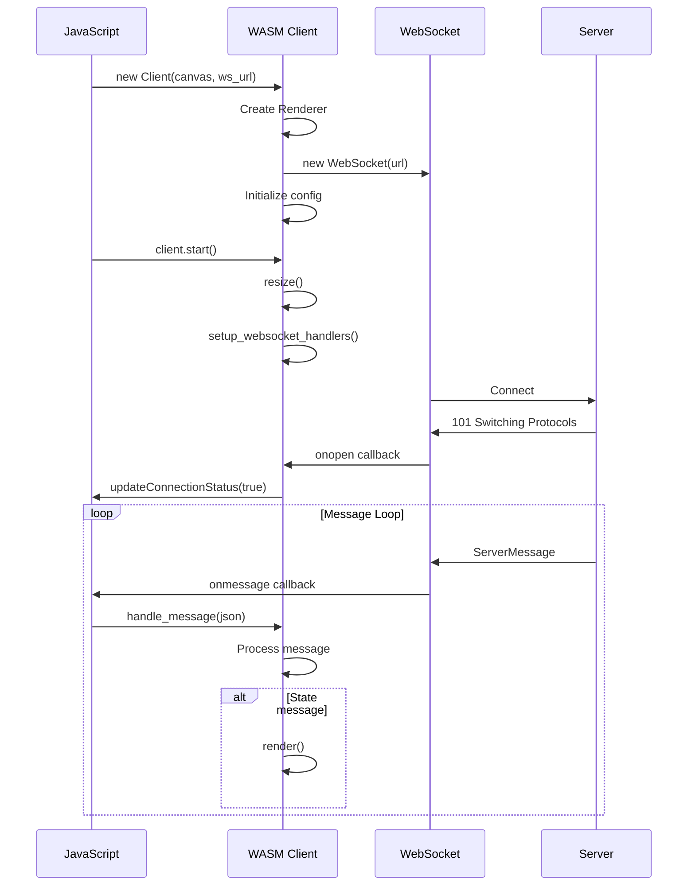

**WebSocket Handler Setup:**

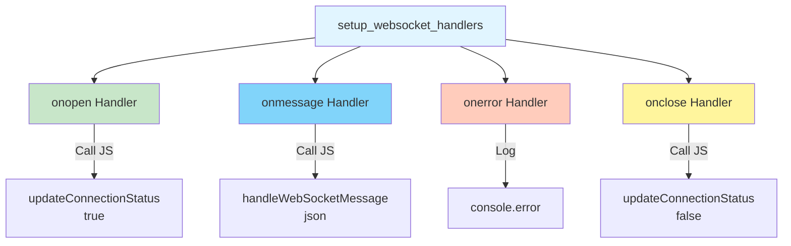

**Message Handling Flow:**

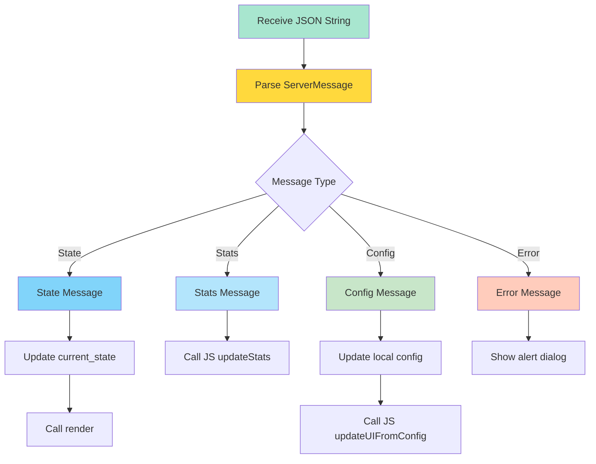

**Configuration Methods:**

| Method | Purpose | Sends to Server |
|--------|---------|-----------------|
| `set_particle_count(usize)` | Change particle count | ✓ UpdateConfig |
| `set_time_step(f32)` | Adjust physics time step | ✓ UpdateConfig |
| `set_gravity_strength(f32)` | Modify gravity constant | ✓ UpdateConfig |
| `set_visual_fps(u32)` | Change render FPS | ✓ UpdateConfig |
| `set_zoom_level(f32)` | Zoom camera in/out | ✓ UpdateConfig |
| `move_camera(f32, f32)` | Pan camera | ✗ Client-only |
| `reset_camera()` | Reset camera position | ✗ Client-only |
| `pause()` | Pause simulation | ✓ Pause |
| `resume()` | Resume simulation | ✓ Resume |
| `reset()` | Reset simulation | ✓ Reset |

---

### renderer.rs - WebGL Rendering Engine

**Purpose**: Manage WebGL context, compile shaders, and render particles.

**Initialization Flow:**

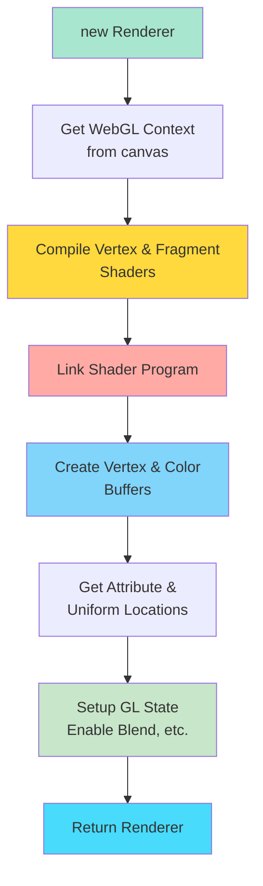

**Renderer State:**

```rust
pub struct Renderer {
    gl: WebGlRenderingContext,      // WebGL context
    program: WebGlProgram,           // Compiled shader program
    vertex_buffer: WebGlBuffer,      // Vertex position buffer
    color_buffer: WebGlBuffer,       // Vertex color buffer

    // Attribute locations
    position_attrib: i32,
    color_attrib: i32,

    // Uniform locations
    projection_uniform: Option<WebGlUniformLocation>,
    camera_offset_uniform: Option<WebGlUniformLocation>,
    zoom_uniform: Option<WebGlUniformLocation>,

    // Camera state
    camera_offset: Vector2<f32>,     // Pan offset
    zoom: f32,                        // Zoom level
}
```

**Render Pipeline:**

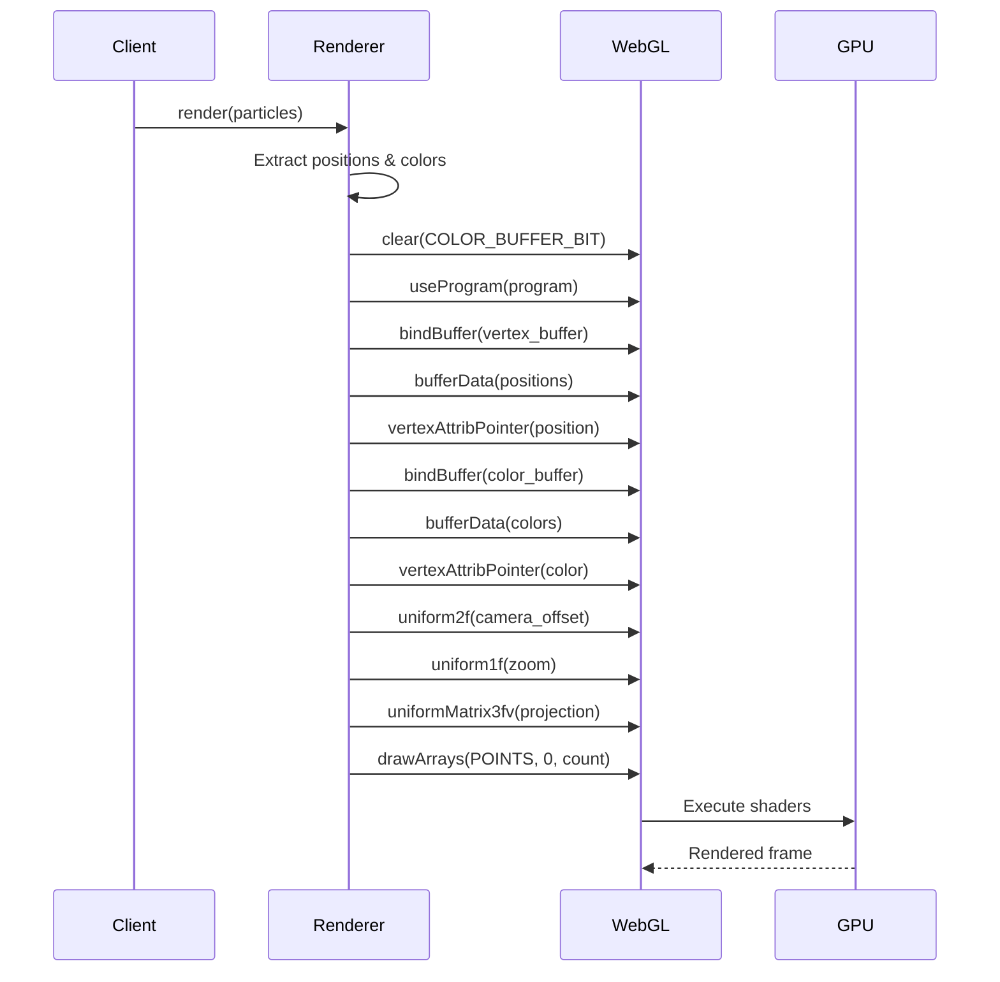

**Data Preparation:**

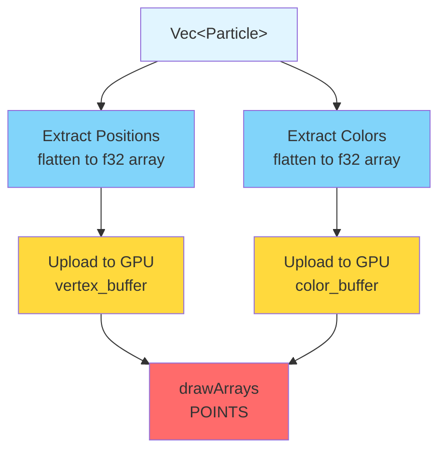

**Camera Transformations:**

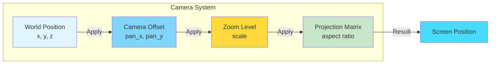

**Uniforms:**

| Uniform | Type | Purpose |
|---------|------|---------|
| `u_projection` | mat3 | Projection matrix (aspect ratio) |
| `u_camera_offset` | vec2 | Camera pan offset |
| `u_zoom` | float | Zoom level multiplier |

**Attributes:**

| Attribute | Type | Purpose |
|-----------|------|---------|
| `a_position` | vec3 | Particle world position |
| `a_color` | vec4 | Particle RGBA color |

---

### Shaders

#### Vertex Shader

**Purpose**: Transform particle positions from world space to screen space.

```glsl
attribute vec3 a_position;
attribute vec4 a_color;

uniform mat3 u_projection;
uniform vec2 u_camera_offset;
uniform float u_zoom;

varying vec4 v_color;

void main() {
    // Apply camera offset and zoom
    vec2 pos = (a_position.xy + u_camera_offset) * u_zoom;

    // Apply projection matrix
    vec3 projected = u_projection * vec3(pos, 1.0);

    gl_Position = vec4(projected.xy, 0.0, 1.0);
    gl_PointSize = 2.0;  // Particle size in pixels
    v_color = a_color;
}
```

**Transformation Pipeline:**

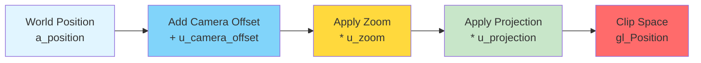

#### Fragment Shader

**Purpose**: Color each particle pixel.

```glsl
precision mediump float;

varying vec4 v_color;

void main() {
    gl_FragColor = v_color;
}
```

**Per-Fragment Processing:**

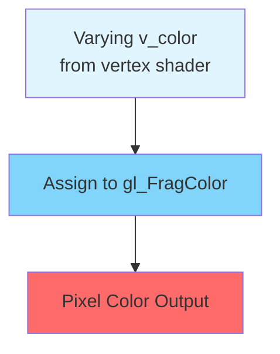

*Note: Simple pass-through shader. Could be extended with particle glow, fade, etc.*

---

## WebGL Rendering

### Rendering Loop

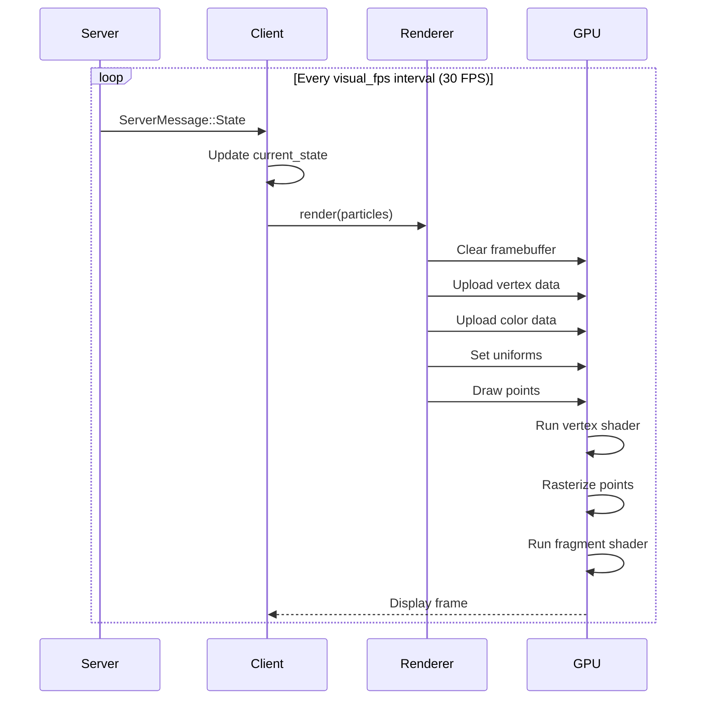

### Performance Characteristics

**Rendering Complexity:**

| Operation | Complexity | Notes |
|-----------|------------|-------|
| Data Extraction | O(n) | Flatten positions & colors |
| Buffer Upload | O(n) | Copy to GPU memory |
| Vertex Processing | O(n) | Run vertex shader per particle |
| Rasterization | O(n) | Generate point primitives |
| Fragment Shading | O(p) | p = pixels covered by points |

**GPU Bottlenecks:**

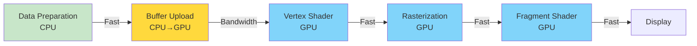

**Typical Performance:**

- **Up to 15K particles**: 60 FPS on modern GPUs
- **Vertex processing**: ~1-2ms
- **Upload overhead**: ~1-2ms
- **Fragment shading**: < 1ms (small point size)

---

## Browser Integration

### JavaScript ↔ WASM Bridge

**Initialization:**

```javascript
// Load WASM module
import init, { Client } from './pkg/n_body_client.js';

// Initialize WASM runtime
await init();

// Create client instance
const canvas = document.getElementById('canvas');
const client = new Client(canvas, 'ws://localhost:4000/ws');

// Start client
client.start();
```

**JavaScript Callbacks:**

The WASM client calls JavaScript functions for UI updates:

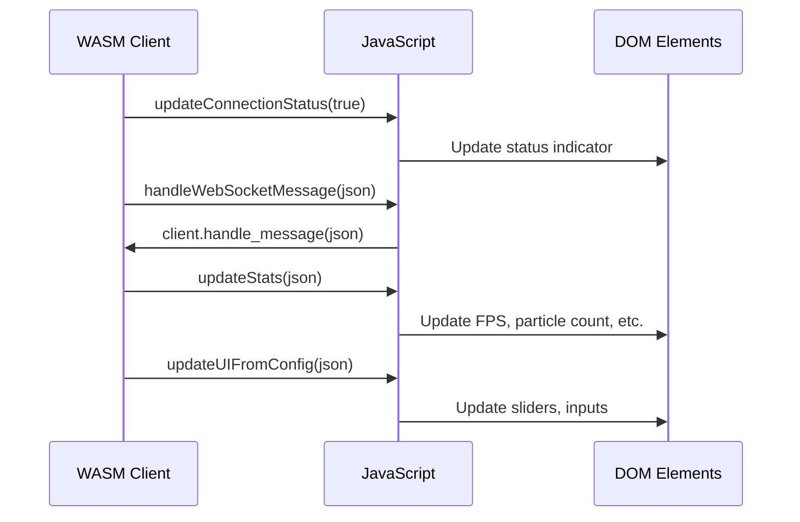

**Global Functions (defined in JavaScript):**

| Function | Purpose | Called By |
|----------|---------|-----------|
| `updateConnectionStatus(bool)` | Update connection indicator | WASM onopen/onclose |
| `handleWebSocketMessage(string)` | Route message to WASM | WASM onmessage |
| `updateStats(string)` | Update performance stats | WASM (Stats message) |
| `updateUIFromConfig(string)` | Sync UI with config | WASM (Config message) |

**User Input Flow:**

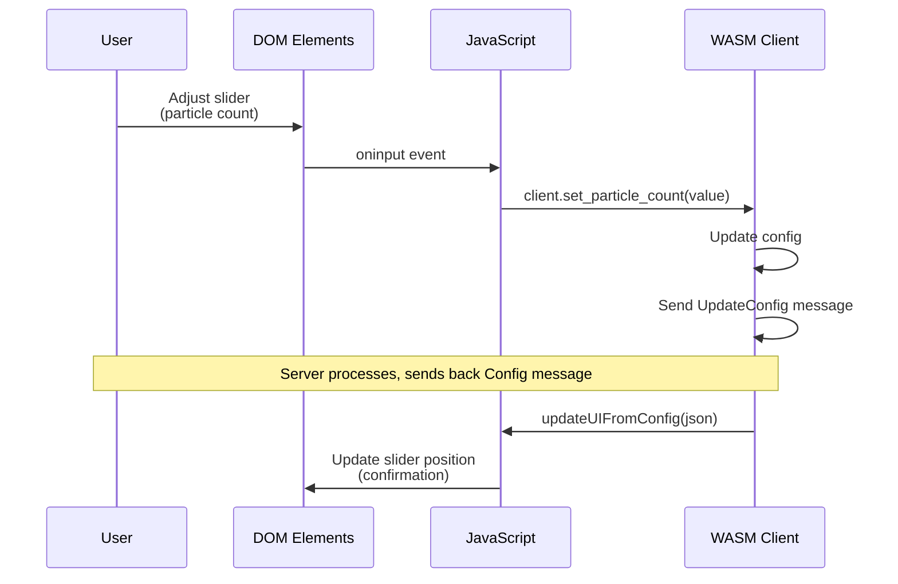

### Memory Management

**WASM Memory Layout:**

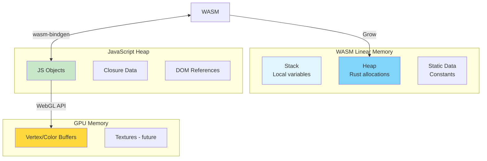

**Ownership:**

- **Rust owns**: Client state, current_state, config
- **JavaScript owns**: DOM elements, event handlers
- **Shared**: WebSocket object (via web-sys bindings)
- **GPU owns**: Vertex/color buffers (uploaded each frame)

### Error Handling

**WASM Error Propagation:**

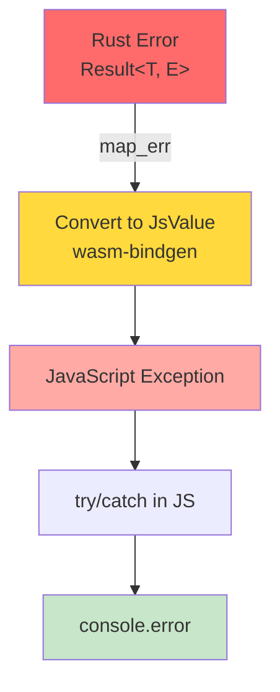

**Common Error Scenarios:**

| Error | Source | Handling |
|-------|--------|----------|
| **WebGL not supported** | Browser | Alert user, disable rendering |
| **WebSocket connection failed** | Network | Show "Disconnected" status |
| **Shader compilation error** | GPU/Driver | Log error, fallback rendering |
| **Invalid message format** | Server | Log error, ignore message |
| **Lock failure** | Server | Server sends Error message |

---

## Build Process

### Compilation Pipeline

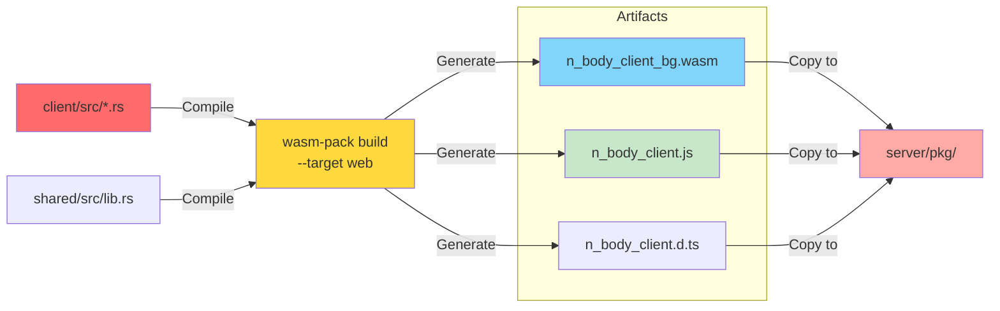

### wasm-pack Configuration

```toml
[package]
name = "n_body_client"
version = "0.1.0"
edition = "2021"

[lib]
crate-type = ["cdylib"]  # Compile as dynamic library for WASM

[dependencies]
wasm-bindgen = "0.2"     # Rust ↔ JS bindings
web-sys = { version = "0.3", features = [
    "WebGlRenderingContext",
    "WebGlProgram",
    "WebGlShader",
    "WebSocket",
    # ... more features
]}
```

**Build Command:**

```bash
wasm-pack build --target web --out-dir ../server/pkg
```

**Output Files:**

| File | Purpose |
|------|---------|
| `*.wasm` | Compiled WebAssembly binary |
| `*.js` | JavaScript glue code for loading WASM |
| `*.d.ts` | TypeScript type definitions |
| `package.json` | NPM package metadata |

---

## Future Enhancements

### Potential Improvements

1. **Instanced Rendering**: Use WebGL instancing for better performance
2. **Particle Glow**: Add fragment shader effects
3. **Trail Effects**: Keep history of recent positions
4. **Octree Culling**: Only render visible particles
5. **Level of Detail**: Reduce particle size/quality at distance
6. **Touch Controls**: Mobile-friendly camera controls
7. **Offscreen Rendering**: Use OffscreenCanvas for background updates

### Advanced Rendering

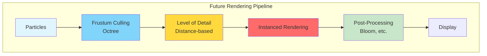

---

## Related Pages

- **[Architecture Overview](Architecture)** - System architecture
- **[Communication Protocol](Communication-Protocol)** - WebSocket messages
- **[Server Components](Server-Components)** - Server details
- **[Development Guide](Development-Guide)** - Building and running

---

[← Back to Home](Home)
