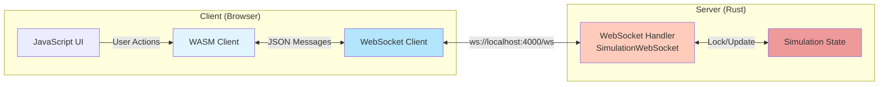
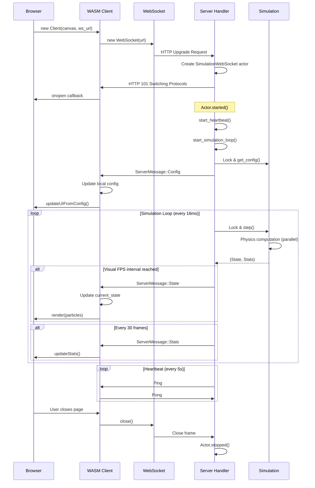
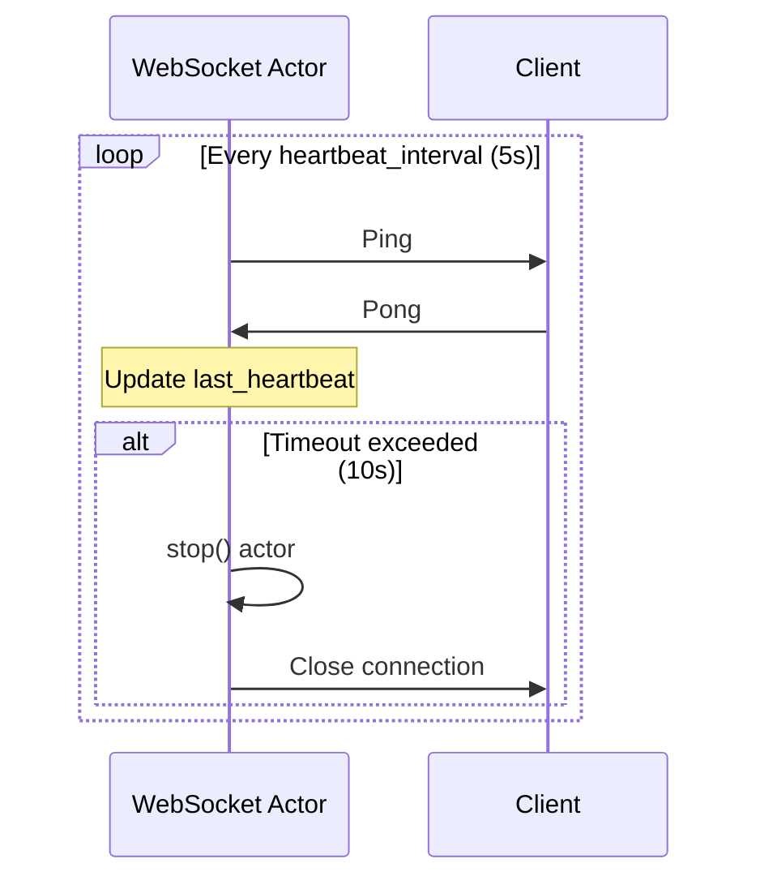
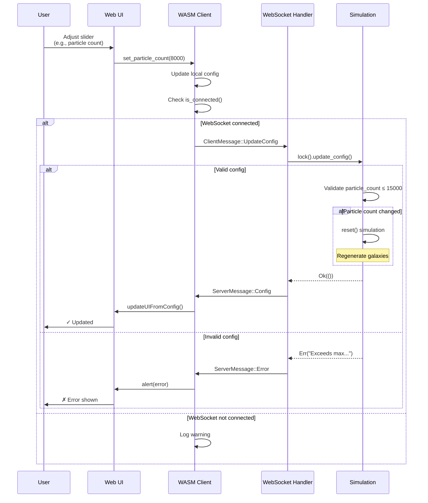
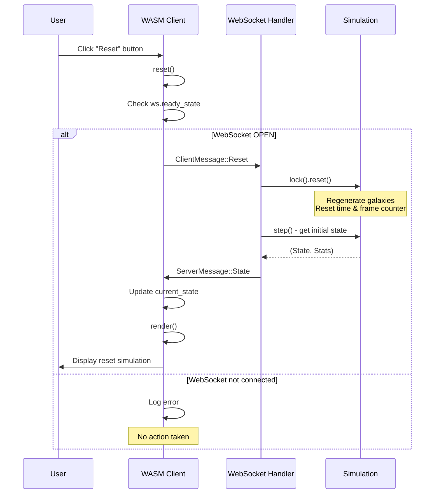
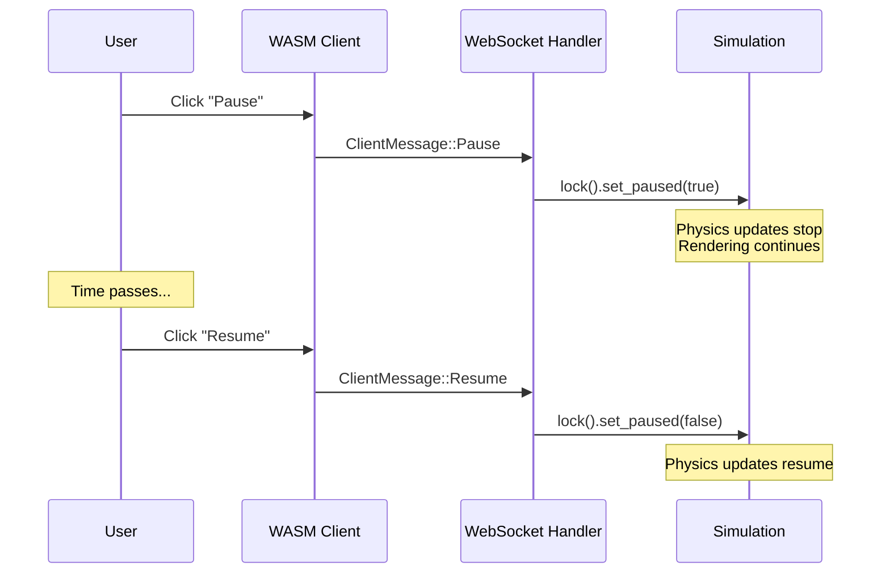
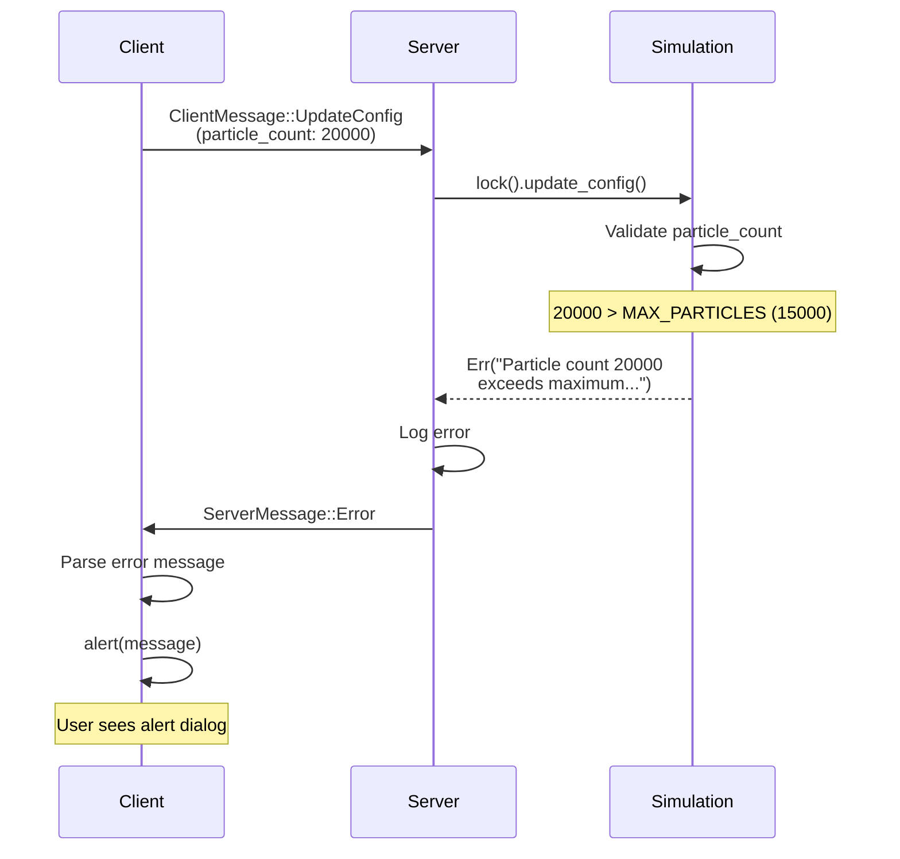
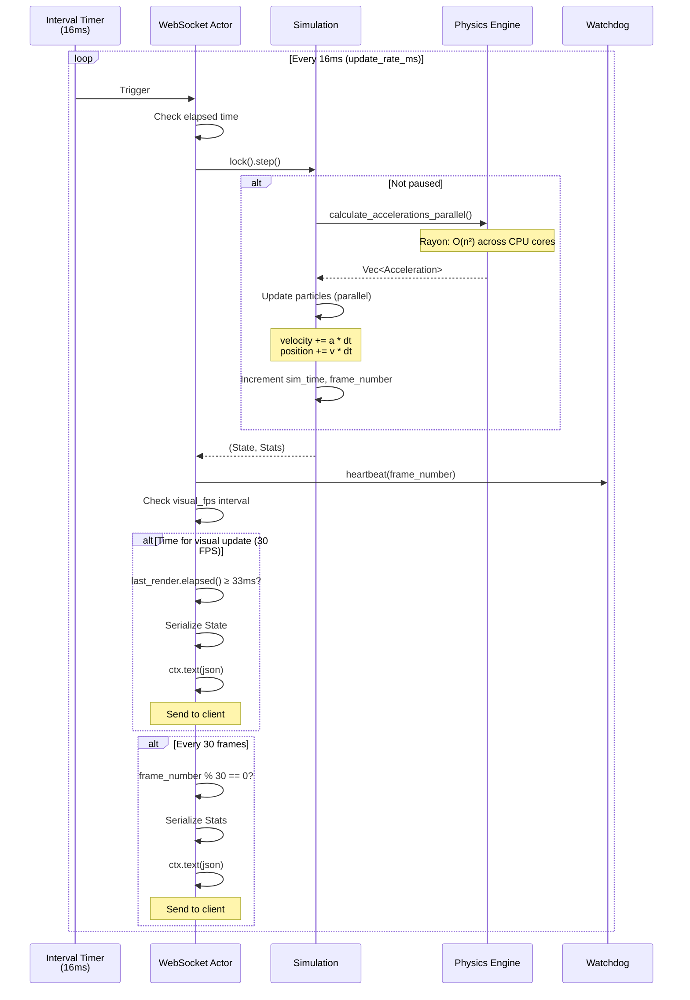

# Communication Protocol

This page details the WebSocket-based communication protocol between the client and server, including message types, sequences, and data formats.

## Table of Contents
- [Protocol Overview](#protocol-overview)
- [Message Types](#message-types)
- [Connection Lifecycle](#connection-lifecycle)
- [Interaction Sequences](#interaction-sequences)
- [Error Handling](#error-handling)

## Protocol Overview

The N-Body simulation uses **WebSocket** for bidirectional, real-time communication with **JSON** message serialization.



### Protocol Characteristics

| Aspect | Detail |
|--------|--------|
| **Transport** | WebSocket (ws:// or wss://) |
| **Serialization** | JSON (via serde_json) |
| **Message Direction** | Bidirectional |
| **Connection Type** | Persistent |
| **Heartbeat** | Ping/Pong every 5s (configurable) |
| **Client Timeout** | 10s without response (configurable) |

## Message Types

### Client → Server Messages

All client messages use a discriminated union with a `type` field:

```rust
#[derive(Serialize, Deserialize, Debug)]
#[serde(tag = "type")]
pub enum ClientMessage {
    UpdateConfig(SimulationConfig),
    Reset,
    Pause,
    Resume,
}
```

#### Message: `UpdateConfig`

Updates simulation parameters.

**JSON Structure:**
```json
{
  "type": "UpdateConfig",
  "particle_count": 5000,
  "time_step": 0.01,
  "gravity_strength": 1.0,
  "visual_fps": 30,
  "zoom_level": 1.0,
  "debug": false
}
```

**Fields:**
- `particle_count`: Number of particles (max: 15,000)
- `time_step`: Physics time step (seconds per frame)
- `gravity_strength`: Gravitational constant multiplier
- `visual_fps`: Target frames per second for rendering
- `zoom_level`: Camera zoom level
- `debug`: Enable verbose logging

#### Message: `Reset`

Resets the simulation to initial state.

**JSON Structure:**
```json
{
  "type": "Reset"
}
```

#### Message: `Pause`

Pauses the simulation (stops physics updates).

**JSON Structure:**
```json
{
  "type": "Pause"
}
```

#### Message: `Resume`

Resumes a paused simulation.

**JSON Structure:**
```json
{
  "type": "Resume"
}
```

### Server → Client Messages

All server messages use a discriminated union with a `type` field:

```rust
#[derive(Serialize, Deserialize, Debug)]
#[serde(tag = "type")]
pub enum ServerMessage {
    State(SimulationState),
    Stats(SimulationStats),
    Config(SimulationConfig),
    Error { message: String },
}
```

#### Message: `State`

Contains the current simulation state with all particle data.

**JSON Structure:**
```json
{
  "type": "State",
  "particles": [
    {
      "position": [1.5, 2.3, -0.5],
      "velocity": [0.1, -0.2, 0.0],
      "mass": 1.5,
      "color": [0.8, 0.8, 1.0, 1.0]
    },
    // ... more particles
  ],
  "sim_time": 45.67,
  "frame_number": 4567
}
```

**Fields:**
- `particles`: Array of particle data
  - `position`: [x, y, z] coordinates
  - `velocity`: [vx, vy, vz] velocity vector
  - `mass`: Particle mass
  - `color`: [r, g, b, a] RGBA color
- `sim_time`: Elapsed simulation time in seconds
- `frame_number`: Sequential frame number

**Frequency:** Sent based on `visual_fps` setting (default: 30 FPS)

#### Message: `Stats`

Contains performance statistics.

**JSON Structure:**
```json
{
  "type": "Stats",
  "fps": 58.5,
  "computation_time_ms": 17.2,
  "particle_count": 5000,
  "sim_time": 45.67,
  "cpu_usage": 65.3,
  "frame_number": 4567
}
```

**Fields:**
- `fps`: Current frames per second
- `computation_time_ms`: Time spent on physics computation
- `particle_count`: Current number of particles
- `sim_time`: Elapsed simulation time
- `cpu_usage`: Estimated CPU usage percentage
- `frame_number`: Sequential frame number

**Frequency:** Every 30 frames (~1 second at 30 FPS)

#### Message: `Config`

Sends current or updated configuration.

**JSON Structure:** Same as `UpdateConfig` client message.

**When Sent:**
- On initial connection
- After successful config update
- After reset

#### Message: `Error`

Reports an error to the client.

**JSON Structure:**
```json
{
  "type": "Error",
  "message": "Particle count 20000 exceeds maximum of 15000..."
}
```

**Common Errors:**
- Particle count exceeds maximum (15,000)
- Invalid configuration values
- Simulation lock failures
- JSON parsing errors

## Connection Lifecycle

### Full Connection Sequence



### Connection Establishment

```mermaid
sequenceDiagram
    participant Client
    participant Server
    participant Actor as WebSocket Actor
    participant Sim as Simulation

    Client->>Server: GET /ws<br/>Upgrade: websocket
    Server->>Actor: Create SimulationWebSocket
    Server->>Client: 101 Switching Protocols

    activate Actor
    Note over Actor: started() method called

    Actor->>Actor: start_heartbeat()
    Note over Actor: Ping every 5s<br/>Timeout after 10s

    Actor->>Actor: start_simulation_loop()
    Note over Actor: Update every 16ms

    Actor->>Sim: lock().get_config()
    Sim-->>Actor: SimulationConfig
    Actor->>Client: ServerMessage::Config

    Note over Actor,Client: Connection Ready
    deactivate Actor
```

### Heartbeat Mechanism



## Interaction Sequences

### Configuration Update



### Reset Simulation



### Pause/Resume



### Error Handling



### Simulation Loop Detail



## Error Handling

### Client-Side Error Handling

```rust
// Example from client/src/lib.rs
match serde_json::from_str::<ServerMessage>(&message) {
    Ok(msg) => match msg {
        ServerMessage::Error { message } => {
            console::error_1(&format!("Server error: {}", message).into());
            window.alert_with_message(&format!("Server Error: {}", message));
        }
        // ... other message types
    },
    Err(e) => {
        console::error_1(&format!("Failed to parse: {}", e).into());
    }
}
```

### Server-Side Error Handling

```rust
// Example from server/src/websocket.rs
match self.simulation.lock() {
    Ok(mut sim) => {
        match msg {
            ClientMessage::UpdateConfig(config) => {
                match sim.update_config(config) {
                    Ok(()) => { /* success */ },
                    Err(error_msg) => {
                        error!("Config update failed: {}", error_msg);
                        let json = serde_json::to_string(
                            &ServerMessage::Error { message: error_msg }
                        )?;
                        ctx.text(json);
                    }
                }
            }
            // ... other message types
        }
    }
    Err(e) => {
        error!("Failed to lock simulation: {}", e);
        // Send error to client
    }
}
```

### Common Error Scenarios

| Error | Cause | Handling |
|-------|-------|----------|
| **Particle count exceeded** | User sets count > 15,000 | Server validates, sends Error message |
| **WebSocket disconnected** | Network issue, server restart | Client shows "Disconnected" status |
| **JSON parse error** | Malformed message | Log error, ignore message |
| **Simulation lock timeout** | Contention, deadlock | Log error, close connection |
| **Computation timeout** | Too many particles | Watchdog logs warning, continues |

## Message Size and Performance

### Typical Message Sizes

| Message Type | Size (particles) | Approximate Size |
|--------------|------------------|------------------|
| State (1000) | 1,000 | ~50 KB |
| State (5000) | 5,000 | ~250 KB |
| State (15000) | 15,000 | ~750 KB |
| Stats | N/A | ~150 bytes |
| Config | N/A | ~100 bytes |
| Control (Reset/Pause) | N/A | ~20 bytes |

### Bandwidth Calculations

At 30 visual FPS with 5000 particles:
- **State messages**: 250 KB × 30 = ~7.5 MB/s
- **Stats messages**: 150 bytes × 1 = ~150 bytes/s (every 30 frames)
- **Total**: ~7.5 MB/s downstream

*Note: visual_fps setting is the primary bandwidth control.*

## Protocol Extensions

Potential future enhancements:

1. **Binary Protocol**: Use MessagePack or bincode for smaller messages
2. **Delta Updates**: Send only changed particles
3. **Compression**: Enable WebSocket compression
4. **Selective Updates**: Allow client to request specific regions
5. **Multiple Clients**: Broadcast to multiple viewers

## Related Pages

- **[Architecture Overview](Architecture)** - System architecture
- **[Server Components](Server-Components)** - WebSocket handler details
- **[Client Components](Client-Components)** - WASM client details

---

[← Back to Home](Home)
