# Configuration

Complete guide to configuring the N-Body simulation server and runtime behavior.

## Table of Contents
- [Configuration File](#configuration-file)
- [Environment Variables](#environment-variables)
- [Runtime Configuration](#runtime-configuration)
- [Tuning Guide](#tuning-guide)

## Configuration File

### config.toml Location

The configuration file `config.toml` is located in the project root and is **auto-generated** on first run if it doesn't exist.

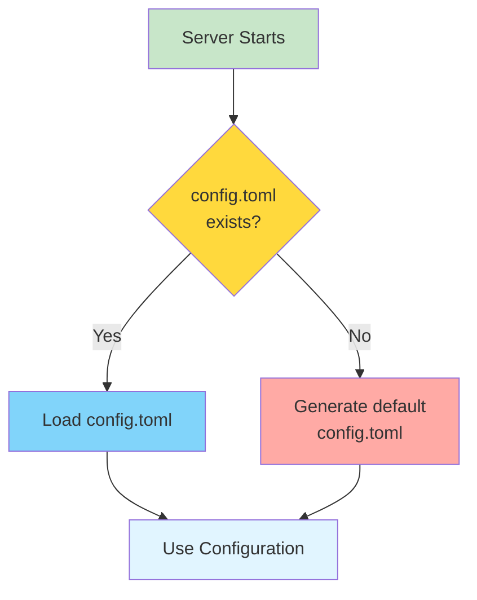

### Default Configuration

```toml
[server]
host = "127.0.0.1"
port = 4000
debug = false

[simulation]
default_particles = 3000
update_rate_ms = 16

[websocket]
heartbeat_interval_sec = 5
client_timeout_sec = 10
```

---

## Configuration Sections

### [server] Section

Controls HTTP server and static file serving.

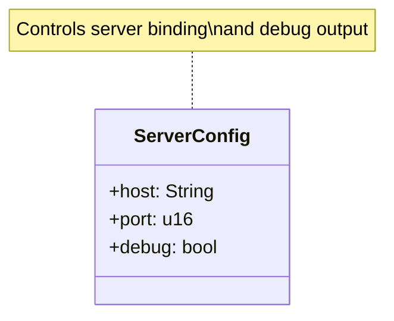

**Fields:**

| Field | Type | Default | Description |
|-------|------|---------|-------------|
| `host` | String | "127.0.0.1" | IP address to bind |
| `port` | u16 | 4000 | Port number |
| `debug` | bool | false | Enable debug logging |

**Host Options:**

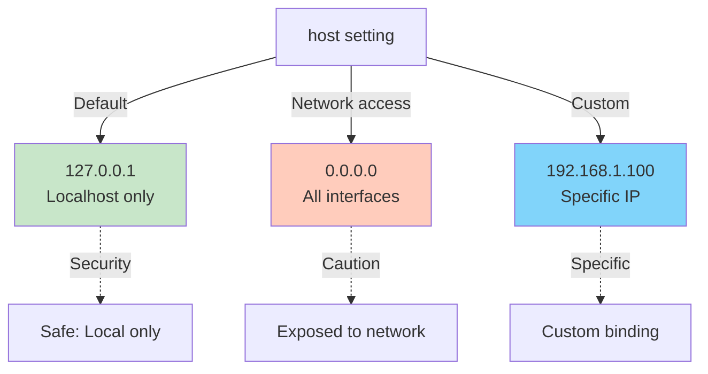

**Example Configurations:**

```toml
# Development (localhost only)
[server]
host = "127.0.0.1"
port = 4000
debug = true

# Production (all interfaces)
[server]
host = "0.0.0.0"
port = 8080
debug = false

# Custom port
[server]
host = "127.0.0.1"
port = 3000
debug = false
```

---

### [simulation] Section

Initial simulation parameters.

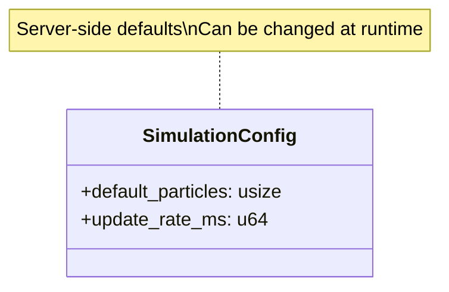

**Fields:**

| Field | Type | Default | Range | Description |
|-------|------|---------|-------|-------------|
| `default_particles` | usize | 3000 | 1-15000 | Initial particle count |
| `update_rate_ms` | u64 | 16 | 1-1000 | Physics update interval (ms) |

**update_rate_ms and FPS:**

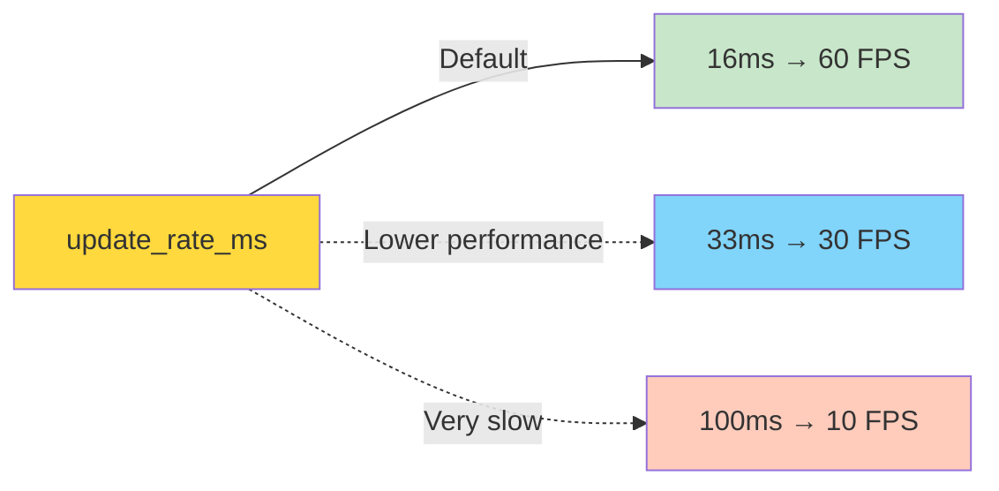

**Formula:**

```
FPS = 1000 / update_rate_ms

Examples:
- 16ms → 62.5 FPS
- 20ms → 50 FPS
- 33ms → 30 FPS
```

**Performance Recommendations:**

| Particle Count | Recommended update_rate_ms | Target FPS |
|----------------|---------------------------|------------|
| 1,000-3,000 | 16ms | 60 FPS |
| 3,000-7,000 | 20-25ms | 40-50 FPS |
| 7,000-12,000 | 33ms | 30 FPS |
| 12,000-15,000 | 50ms | 20 FPS |

---

### [websocket] Section

WebSocket connection health monitoring.

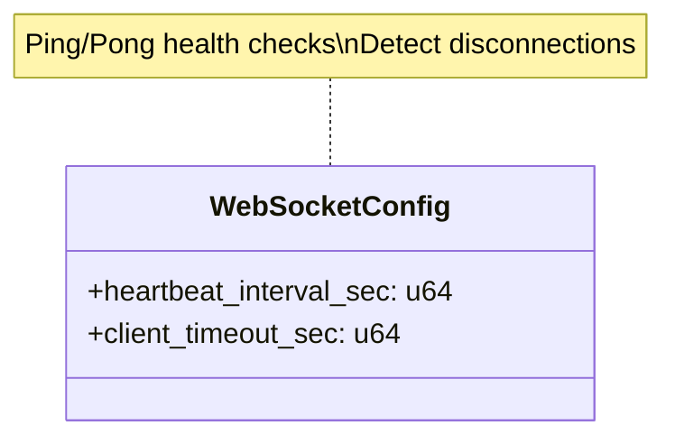

**Fields:**

| Field | Type | Default | Range | Description |
|-------|------|---------|-------|-------------|
| `heartbeat_interval_sec` | u64 | 5 | 1-60 | Ping interval |
| `client_timeout_sec` | u64 | 10 | 2-120 | Timeout threshold |

**Heartbeat Mechanism:**

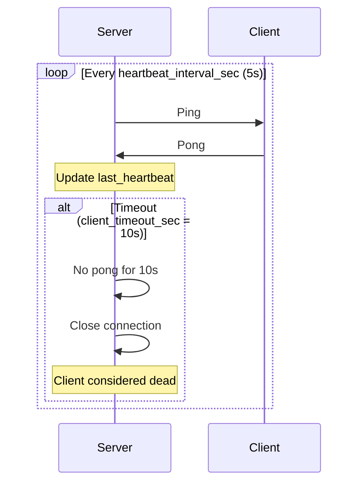

**Relationship:**

```
client_timeout_sec should be > heartbeat_interval_sec × 2

Recommended:
- heartbeat_interval_sec: 5
- client_timeout_sec: 10 (2× interval)
```

**Tuning:**

```toml
# Aggressive detection (fast network)
[websocket]
heartbeat_interval_sec = 2
client_timeout_sec = 5

# Conservative (slow/unreliable network)
[websocket]
heartbeat_interval_sec = 10
client_timeout_sec = 30
```

---

## Environment Variables

Environment variables override config file settings.

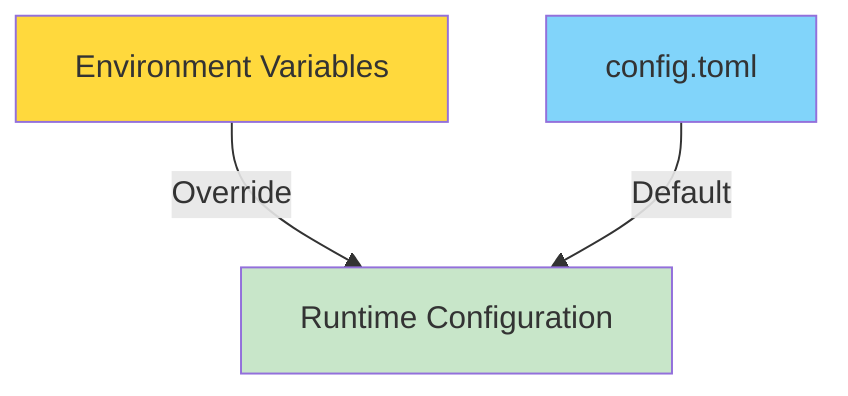

### RUST_LOG

Controls logging verbosity.

**Format:**

```bash
RUST_LOG=<level>
RUST_LOG=<module>=<level>
```

**Levels (least to most verbose):**


**Examples:**

```bash
# Show only errors
RUST_LOG=error ./target/release/n_body_server

# Show info and above (default recommended)
RUST_LOG=info ./target/release/n_body_server

# Show debug logs
RUST_LOG=debug ./target/release/n_body_server

# Per-module logging
RUST_LOG=n_body_server::simulation=debug,n_body_server=info

# All trace (very verbose)
RUST_LOG=trace ./target/release/n_body_server
```

**What Each Level Shows:**

| Level | Shows |
|-------|-------|
| `error` | Critical errors only |
| `warn` | Warnings + errors (performance issues, etc.) |
| `info` | General info + warnings + errors (recommended) |
| `debug` | Debug details + all above (development) |
| `trace` | All logs including function calls (debugging) |

---

### N_BODY_DEBUG

Enables debug mode in simulation.

```bash
N_BODY_DEBUG=1 ./target/release/n_body_server
```

**Effects:**

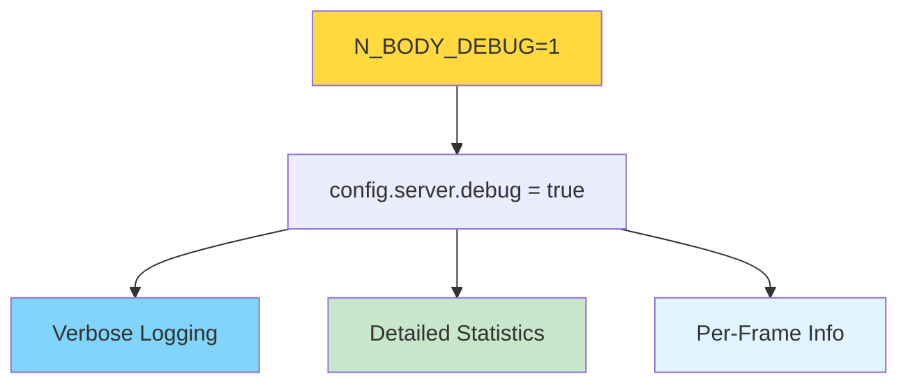

**Debug Output Example:**

```
=== DEBUG MODE ENABLED ===
Server config: ServerConfig { host: "127.0.0.1", port: 4000, debug: true }
Simulation config: SimulationConfig { default_particles: 3000, update_rate_ms: 16 }
WebSocket config: WebSocketConfig { heartbeat_interval_sec: 5, client_timeout_sec: 10 }

[DEBUG] WebSocket connection established
[DEBUG] Sending initial config
[DEBUG] Client config updated: 5000 particles
[DEBUG] Frame 100: 5000 particles, 15.2ms computation time
```

---

### RUST_BACKTRACE

Enable stack traces on panics.

```bash
# Show backtrace on crash
RUST_BACKTRACE=1 ./target/release/n_body_server

# Full backtrace (all frames)
RUST_BACKTRACE=full ./target/release/n_body_server
```

**Use Cases:**

- Debugging crashes
- Investigating panics
- Development troubleshooting

---

## Runtime Configuration

Configuration that can be changed while the server is running (via WebSocket messages).

### Client-Configurable Parameters

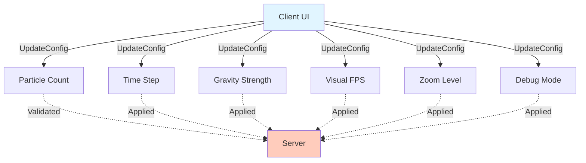

**Adjustable Parameters:**

| Parameter | Type | Runtime Changeable | Requires Reset |
|-----------|------|-------------------|----------------|
| `particle_count` | usize | ✅ Yes | ✅ Yes |
| `time_step` | f32 | ✅ Yes | ❌ No |
| `gravity_strength` | f32 | ✅ Yes | ❌ No |
| `visual_fps` | u32 | ✅ Yes | ❌ No |
| `zoom_level` | f32 | ✅ Yes | ❌ No |
| `debug` | bool | ✅ Yes | ❌ No |

**Reset Behavior:**


---

## Tuning Guide

### Performance Tuning

**Goal: Maximize FPS at target particle count**

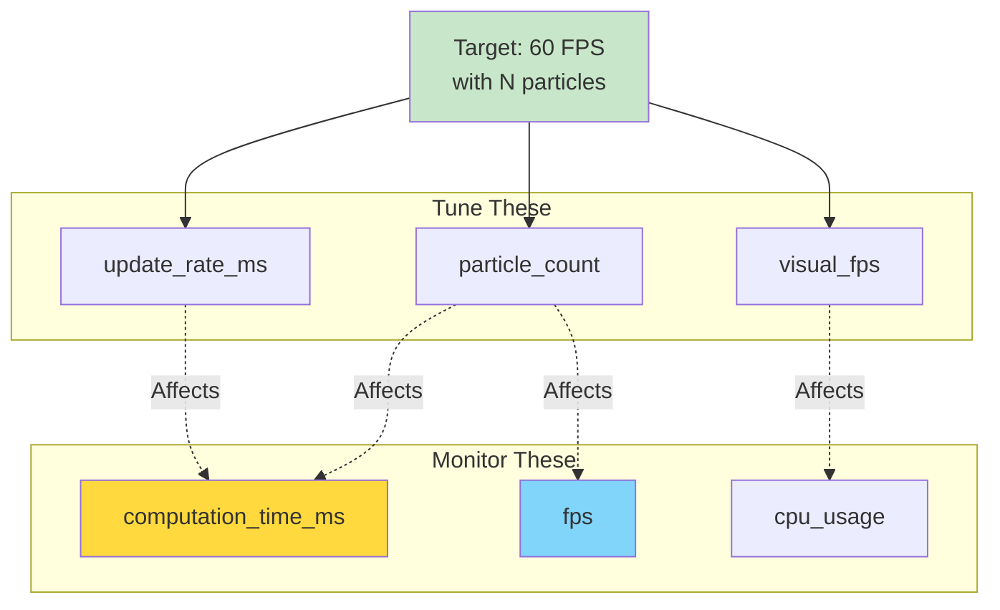

**Tuning Process:**

1. **Start with defaults**
   ```toml
   [simulation]
   default_particles = 3000
   update_rate_ms = 16
   ```

2. **Increase particles gradually**
   - Monitor `computation_time_ms` in stats
   - Target: < 100ms per frame
   - If exceeded: reduce particles or increase `update_rate_ms`

3. **Adjust visual FPS**
   - Higher visual_fps = more bandwidth
   - Lower visual_fps = smoother network performance
   - Recommended: 20-30 FPS for most cases

4. **Fine-tune update rate**
   - 16ms (60 FPS): Ideal for < 5K particles
   - 33ms (30 FPS): Good for 5K-10K particles
   - 50ms (20 FPS): Works for 10K-15K particles

---

### Network Tuning

**Goal: Minimize bandwidth while maintaining smooth visuals**

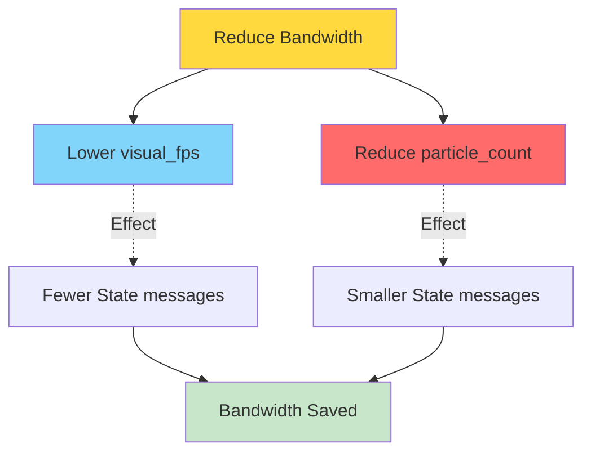

**Bandwidth Calculation:**

```
Bandwidth ≈ particle_count × 40 bytes × visual_fps

Examples:
- 3000 particles @ 30 FPS = 3.6 MB/s
- 5000 particles @ 30 FPS = 6.0 MB/s
- 5000 particles @ 15 FPS = 3.0 MB/s
```

**Recommendations:**

| Network | visual_fps | particle_count |
|---------|-----------|----------------|
| Local (localhost) | 60 | 15000 |
| LAN (fast) | 30-60 | 10000 |
| WiFi (good) | 20-30 | 5000 |
| Slow network | 10-15 | 3000 |

---

### Debug Performance

**Tip:** Disable debug mode in production for better performance.

```toml
[server]
debug = false  # Better performance
```

**Debug Mode Overhead:**

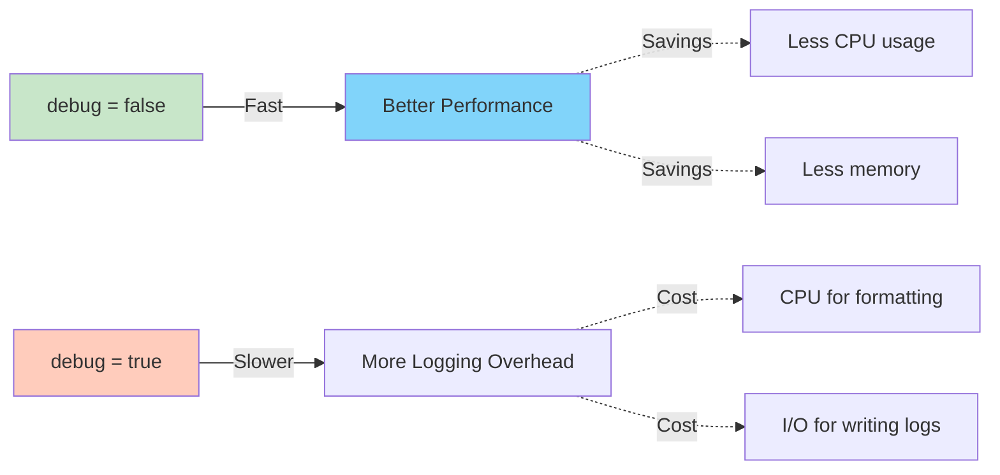

---

## Configuration Examples

### High Performance (Local Development)

```toml
[server]
host = "127.0.0.1"
port = 4000
debug = true

[simulation]
default_particles = 5000
update_rate_ms = 16  # 60 FPS

[websocket]
heartbeat_interval_sec = 5
client_timeout_sec = 10
```

**With environment:**

```bash
RUST_LOG=info ./scripts/dev.sh
```

---

### Production (Network Server)

```toml
[server]
host = "0.0.0.0"
port = 8080
debug = false

[simulation]
default_particles = 3000
update_rate_ms = 20  # 50 FPS

[websocket]
heartbeat_interval_sec = 10
client_timeout_sec = 30
```

**With environment:**

```bash
RUST_LOG=warn ./target/release/n_body_server
```

---

### Low-End Hardware

```toml
[server]
host = "127.0.0.1"
port = 4000
debug = false

[simulation]
default_particles = 1000
update_rate_ms = 33  # 30 FPS

[websocket]
heartbeat_interval_sec = 5
client_timeout_sec = 10
```

**Client settings:**

- visual_fps: 15-20
- particle_count: 1000-2000

---

## Troubleshooting

### Issue: Config changes not applied

**Cause:** Config file cached.

**Solution:** Restart server after editing `config.toml`.

```bash
# Stop server (Ctrl+C)
# Edit config.toml
# Restart
./scripts/serve.sh
```

---

### Issue: Port already in use

**Error:**

```
Error: Address already in use (os error 98)
```

**Solution:** Change port in config or kill existing process.

```toml
[server]
port = 4001  # Different port
```

```bash
# Or kill process on port 4000
lsof -ti:4000 | xargs kill -9
```

---

## Related Pages

- **[Development Guide](Development-Guide)** - Build and run instructions
- **[Server Components](Server-Components)** - Server architecture details
- **[Architecture Overview](Architecture)** - System design

---

[← Back to Home](Home)
