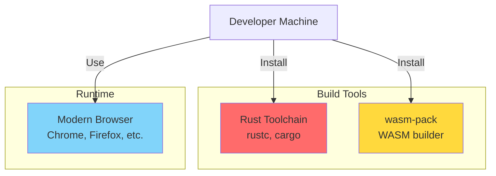
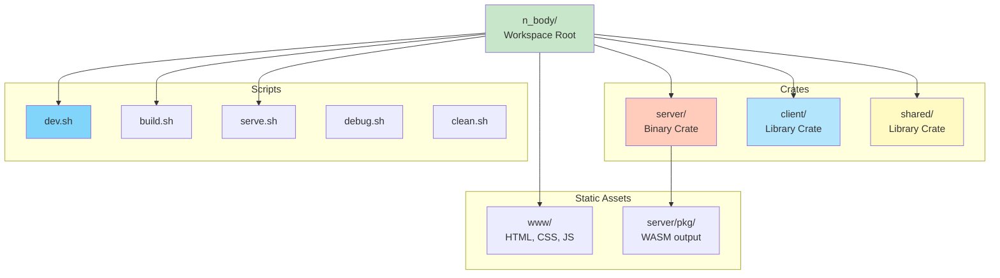
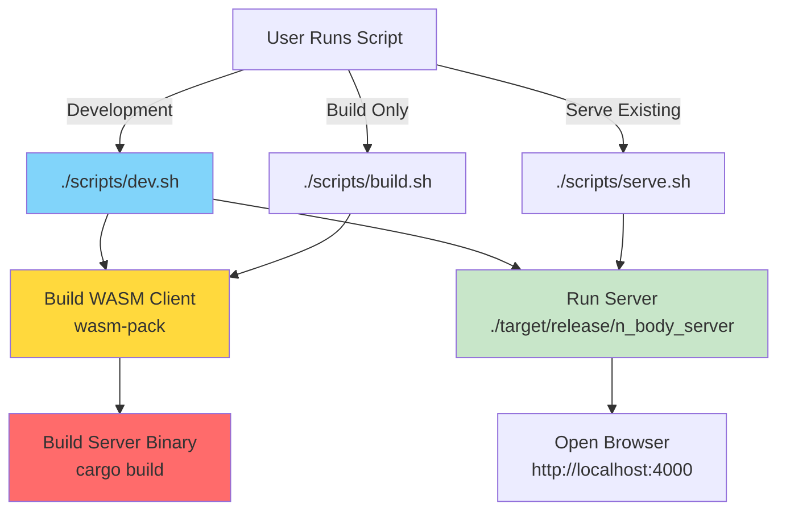
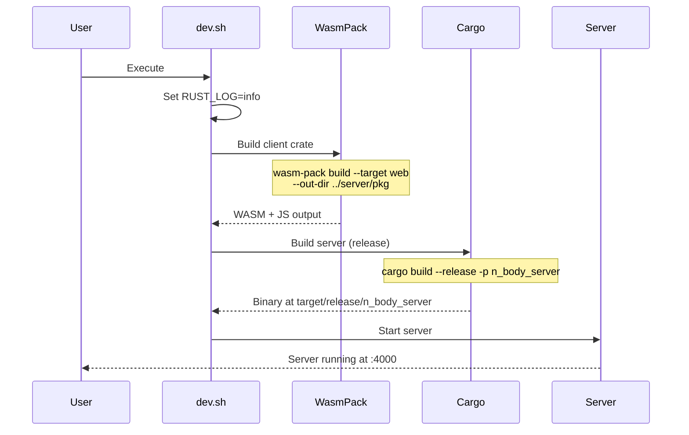
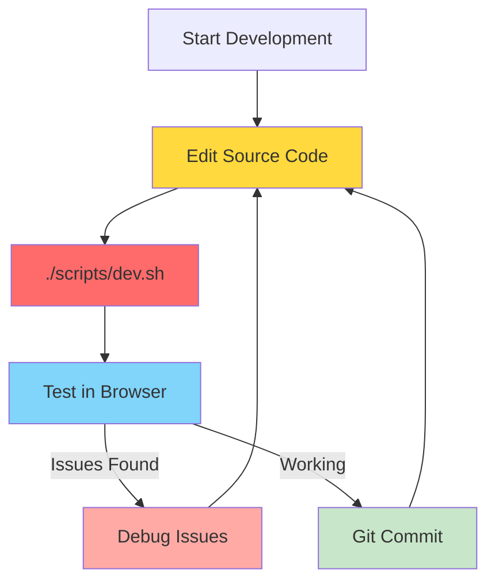
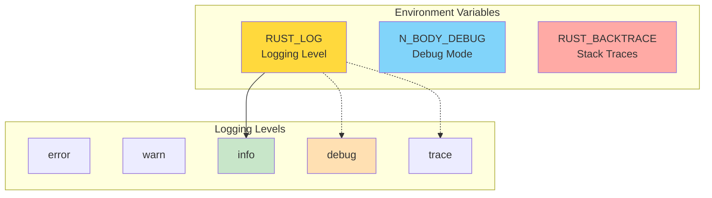
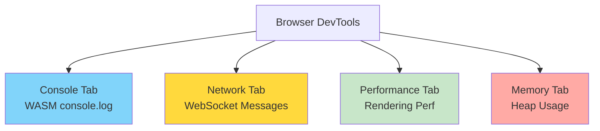
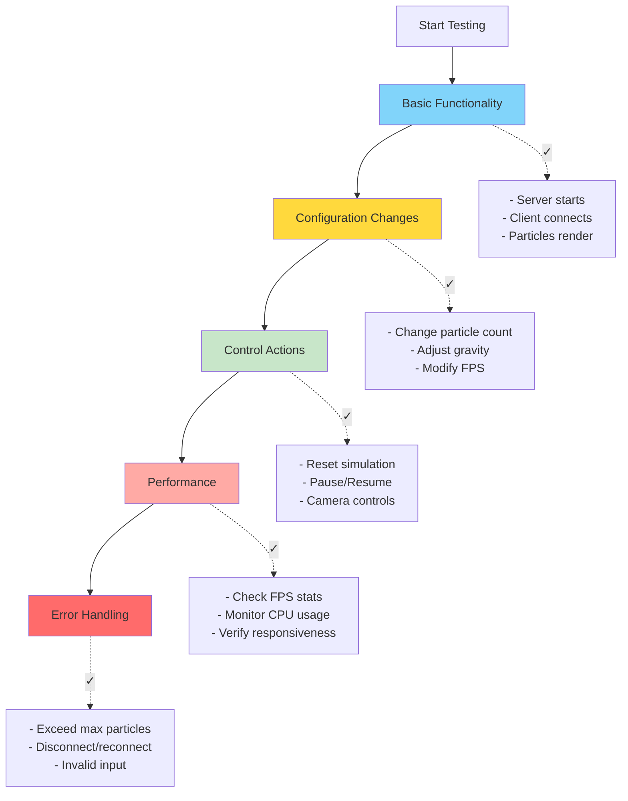

# Development Guide

Complete guide for building, running, testing, and developing the N-Body simulation project.

## Table of Contents
- [Prerequisites](#prerequisites)
- [Project Setup](#project-setup)
- [Build Scripts](#build-scripts)
- [Development Workflow](#development-workflow)
- [Configuration](#configuration)
- [Debugging](#debugging)
- [Common Issues](#common-issues)

## Prerequisites

### Required Tools



**Installation:**

```bash
# Install Rust (if not already installed)
curl --proto '=https' --tlsv1.2 -sSf https://sh.rustup.rs | sh

# Install wasm-pack
cargo install wasm-pack

# Verify installations
rustc --version
cargo --version
wasm-pack --version
```

**Minimum Versions:**

| Tool | Minimum Version | Recommended |
|------|----------------|-------------|
| Rust | 1.70+ | Latest stable |
| wasm-pack | 0.12+ | Latest |
| Browser | WebGL 1.0 support | Modern browser |

---

## Project Setup

### Clone Repository

```bash
git clone https://github.com/your-username/n_body.git
cd n_body
```

### Workspace Structure



### Dependency Installation

Dependencies are automatically downloaded on first build:

```bash
# This happens automatically during build
cargo fetch
```

---

## Build Scripts

All build scripts are located in `scripts/` directory.

### Build Process Flow



### dev.sh - Build and Run (Recommended)

**Purpose**: Complete development workflow - build everything and start server.

```bash
./scripts/dev.sh
```

**What it does:**



**Output:**

```
Building WASM module...
[INFO]: 🎯  Checking for the Wasm target...
[INFO]: 🌀  Compiling to Wasm...
[INFO]: ⬇️  Installing wasm-bindgen...
[INFO]: ✨   Done in 15s

Building server...
   Compiling n_body_server v0.1.0
    Finished release [optimized] target(s) in 30s

Starting server...
Server starting at http://127.0.0.1:4000
```

---

### build.sh - Build Only

**Purpose**: Compile WASM and server without running.

```bash
./scripts/build.sh
```

**Use Cases:**

- CI/CD pipelines
- Pre-deployment builds
- Checking for compilation errors

**Outputs:**

- `server/pkg/` - WASM module and JS glue
- `target/release/n_body_server` - Server binary

---

### serve.sh - Run Pre-Built Server

**Purpose**: Start server using existing build artifacts.

```bash
./scripts/serve.sh
```

**Prerequisites:** Must have run `build.sh` or `dev.sh` first.

**Faster than `dev.sh`**: Skips compilation step.

---

### debug.sh - Debug Mode

**Purpose**: Start server with verbose logging and debug output.

```bash
./scripts/debug.sh
```

**Environment Variables Set:**

```bash
RUST_LOG=debug
N_BODY_DEBUG=1
RUST_BACKTRACE=1
```

**Output Includes:**

- Debug-level logs from all modules
- Server configuration details
- WebSocket message details
- Physics computation timing
- Full stack traces on errors

**Example Output:**

```
=== DEBUG MODE ENABLED ===
Server config: ServerConfig { host: "127.0.0.1", port: 4000, debug: true }
Simulation config: SimulationConfig { default_particles: 3000, ... }
WebSocket config: WebSocketConfig { heartbeat_interval_sec: 5, ... }

[DEBUG] WebSocket connection established
[DEBUG] Received config: 3000 particles, debug: true
[DEBUG] Received state: 3000 particles, frame 123, sim_time 1.23s
...
```

---

### clean.sh - Clean Build Artifacts

**Purpose**: Remove build outputs and optionally Cargo.lock.

```bash
# Clean build artifacts
./scripts/clean.sh

# Also remove Cargo.lock (full clean)
./scripts/clean.sh --all
```

**What Gets Removed:**

| Flag | Removes |
|------|---------|
| (none) | `target/`, `server/pkg/` |
| `--all` | Above + `Cargo.lock` |

**When to Use:**

- Build errors or corruption
- Switching between debug/release
- Freeing disk space
- Full rebuild needed

---

## Development Workflow

### Typical Development Cycle



### Quick Iteration Loop

**For server-only changes:**

```bash
# Build and run server only (faster)
cargo build --release -p n_body_server && ./target/release/n_body_server
```

**For client-only changes:**

```bash
# Build WASM only
cd client
wasm-pack build --target web --out-dir ../server/pkg

# Then refresh browser (Ctrl+Shift+R for hard refresh)
```

**For protocol/shared changes:**

```bash
# Must rebuild both client and server
./scripts/dev.sh
```

---

### Hot Reload (Manual)

The project doesn't include automatic hot reload. Manual steps:

1. **Keep server running**
2. **Edit client code**
3. **Rebuild WASM**: `cd client && wasm-pack build --target web --out-dir ../server/pkg`
4. **Hard refresh browser**: `Ctrl+Shift+R` (or `Cmd+Shift+R` on Mac)

**Server changes require restart:**

```bash
# Ctrl+C to stop
# Rebuild and restart
cargo build --release -p n_body_server && ./target/release/n_body_server
```

---

## Configuration

### config.toml Structure

Auto-generated on first run at project root:

```toml
[server]
host = "127.0.0.1"
port = 4000
debug = false

[simulation]
default_particles = 3000
update_rate_ms = 16  # 60 FPS

[websocket]
heartbeat_interval_sec = 5
client_timeout_sec = 10
```

### Environment Variables



**Setting Variables:**

```bash
# Linux/Mac
export RUST_LOG=debug
export N_BODY_DEBUG=1
export RUST_BACKTRACE=1

# Windows (PowerShell)
$env:RUST_LOG="debug"
$env:N_BODY_DEBUG="1"
$env:RUST_BACKTRACE="1"
```

**Log Level Effects:**

| Level | Shows |
|-------|-------|
| `error` | Errors only |
| `warn` | Warnings + errors |
| `info` | Info + warnings + errors (default) |
| `debug` | Debug + info + warnings + errors |
| `trace` | All logs (very verbose) |

---

## Debugging

### Server Debugging

**Logging:**

```rust
// In server code
use log::{debug, info, warn, error};

info!("Server starting...");
debug!("Frame {}: {} particles", frame, count);
warn!("Computation time high: {}ms", time);
error!("Failed to lock simulation: {}", err);
```

**Watchdog Monitoring:**

The watchdog thread logs if simulation hangs for >10 seconds.

**Performance Monitoring:**

```rust
// simulation.rs tracks computation time
if self.last_computation_time > MAX_COMPUTATION_TIME_MS {
    log::warn!(
        "Computation time {:.1}ms exceeds threshold",
        self.last_computation_time
    );
}
```

### Client Debugging

**Browser DevTools:**



**Console Logging:**

```rust
// In client code
use web_sys::console;

console::log_1(&"Client initialized".into());
console::error_1(&format!("Error: {}", err).into());
```

**WebSocket Inspection:**

1. Open DevTools (F12)
2. Go to **Network** tab
3. Filter by **WS** (WebSocket)
4. Click on the WebSocket connection
5. View **Messages** tab

```
↑ SENT: {"type":"UpdateConfig","particle_count":5000,...}
↓ RECEIVED: {"type":"State","particles":[...],...}
↓ RECEIVED: {"type":"Stats","fps":58.5,...}
```

**WebGL Debugging:**

Chrome Extension: [Spector.js](https://chrome.google.com/webstore/detail/spectorjs)

- Capture WebGL frames
- Inspect draw calls
- View shader source
- Check buffer data

---

## Common Issues

### Build Errors

#### Issue: `wasm-pack not found`

```
error: command not found: wasm-pack
```

**Solution:**

```bash
cargo install wasm-pack
```

#### Issue: `linking with cc failed`

```
error: linking with `cc` failed: exit status: 1
```

**Solution:** Install build tools.

```bash
# Ubuntu/Debian
sudo apt-get install build-essential

# macOS
xcode-select --install

# Windows
# Install Visual Studio with C++ support
```

#### Issue: `web-sys` feature missing

```
error: no variant or associated item named `WebGlRenderingContext`
```

**Solution:** Ensure `web-sys` features are enabled in `client/Cargo.toml`:

```toml
web-sys = { version = "0.3", features = [
    "WebGlRenderingContext",
    "WebGlProgram",
    # ... etc
]}
```

---

### Runtime Errors

#### Issue: Server fails to bind port

```
Error: Address already in use (os error 98)
```

**Solution:** Kill process on port 4000 or change port in `config.toml`.

```bash
# Linux/Mac
lsof -ti:4000 | xargs kill -9

# Windows
netstat -ano | findstr :4000
taskkill /PID <PID> /F
```

#### Issue: WebSocket connection failed

```
WebSocket error: Connection refused
```

**Solutions:**

1. Ensure server is running
2. Check firewall settings
3. Verify correct URL: `ws://localhost:4000/ws`
4. Check browser console for CORS errors

#### Issue: WASM module not loading

```
TypeError: Failed to fetch dynamically imported module
```

**Solutions:**

1. Hard refresh browser: `Ctrl+Shift+R`
2. Check that `server/pkg/` contains WASM files
3. Rebuild client: `./scripts/build.sh`
4. Clear browser cache

---

### Performance Issues

#### Issue: Low FPS with many particles

**Symptoms:**

```
Computation time 250.5ms exceeds threshold of 200.0ms
Server struggling with 15000 particles
```

**Solutions:**

1. **Reduce particle count**: Set to 5000 or less
2. **Lower visual FPS**: Set to 15-30 FPS
3. **Check CPU usage**: Ensure not thermal throttling
4. **Close other applications**: Free CPU resources

#### Issue: High network usage

**Symptoms:** Browser network tab shows sustained high bandwidth.

**Solutions:**

1. **Lower visual_fps**: Reduces message frequency
2. **Reduce particle count**: Smaller State messages
3. **Check for reconnection loops**: Debug WebSocket

---

### Debug Mode Not Working

**Issue:** Debug logs not appearing.

**Solutions:**

```bash
# Ensure environment variable is set
export RUST_LOG=debug

# Or use debug script
./scripts/debug.sh

# Verify in server output
# Should see: === DEBUG MODE ENABLED ===
```

---

## Testing

### Manual Testing Checklist



### Browser Compatibility

Tested on:

| Browser | Version | Status |
|---------|---------|--------|
| Chrome | 90+ | ✅ Fully supported |
| Firefox | 88+ | ✅ Fully supported |
| Safari | 14+ | ✅ Fully supported |
| Edge | 90+ | ✅ Fully supported |
| Mobile browsers | Modern | ⚠️ Limited (touch controls needed) |

---

## Deployment

### Production Build

```bash
# Clean build
./scripts/clean.sh

# Build release artifacts
./scripts/build.sh

# Verify outputs
ls -lh target/release/n_body_server
ls -lh server/pkg/*.wasm
```

### Running in Production

```bash
# Copy necessary files to production server
scp -r target/release/n_body_server user@server:/opt/n_body/
scp -r www/ user@server:/opt/n_body/
scp -r server/pkg/ user@server:/opt/n_body/www/

# On production server
cd /opt/n_body
./n_body_server
```

### Systemd Service (Linux)

```ini
[Unit]
Description=N-Body Simulation Server
After=network.target

[Service]
Type=simple
User=n_body
WorkingDirectory=/opt/n_body
ExecStart=/opt/n_body/n_body_server
Restart=on-failure
Environment="RUST_LOG=info"

[Install]
WantedBy=multi-user.target
```

---

## Code Organization Best Practices

### Adding New Features

**Server-side:**

1. Add logic to appropriate module (`simulation.rs`, `physics.rs`, etc.)
2. Update `shared/src/lib.rs` if adding new message types
3. Handle new messages in `websocket.rs`
4. Add configuration options to `config.rs` if needed

**Client-side:**

1. Add rendering code to `renderer.rs`
2. Update `lib.rs` for new message handling
3. Add UI controls in `www/index.html`
4. Update JavaScript glue code

**Protocol changes:**

1. Update `shared/src/lib.rs` message types
2. Rebuild both client and server
3. Update wiki documentation

---

## Related Pages

- **[Architecture Overview](Architecture)** - System design
- **[Server Components](Server-Components)** - Server details
- **[Client Components](Client-Components)** - Client details
- **[Communication Protocol](Communication-Protocol)** - Message protocol

---

[← Back to Home](Home)
