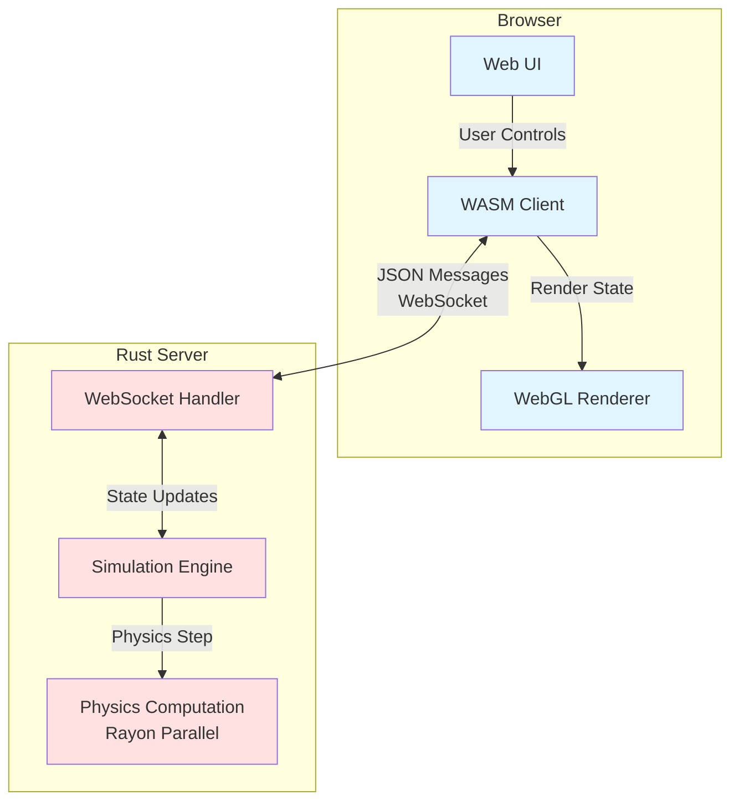

# N-Body Galaxy Collision Simulation - Wiki

Welcome to the N-Body Galaxy Collision Simulation wiki! This project demonstrates a high-performance galaxy collision simulation using a multi-threaded Rust server and WebAssembly client architecture.

## Overview

This simulation showcases two galaxies colliding in real-time with up to 15,000 particles. The system uses:
- **Server-side physics** with parallel computation using Rayon
- **WebAssembly client** for GPU-accelerated WebGL rendering
- **Real-time WebSocket communication** for state synchronization



## Key Features

- **High Performance**: Supports 10K+ particles at 60 FPS on modern hardware
- **Parallel Computing**: Uses all CPU cores via Rayon for physics calculations
- **Real-time Visualization**: WebGL-based rendering with custom shaders
- **Configurable**: Adjustable particle count, gravity, time step, and visual FPS
- **Responsive**: FPS throttling to minimize network traffic

## Performance Characteristics

| Aspect | Details |
|--------|---------|
| **Physics** | CPU-bound, scales with core count |
| **Rendering** | GPU-bound (WebGL) |
| **Network** | Minimized via FPS throttling |
| **Max Particles** | 15,000 (safety limit) |
| **Target FPS** | 60 FPS |
| **Complexity** | O(n²) n-body algorithm |

## Quick Links

### Architecture & Design
- **[Architecture Overview](Architecture)** - Detailed system architecture with block diagrams
- **[Communication Protocol](Communication-Protocol)** - WebSocket message protocol and sequence diagrams
- **[Data Flow](Data-Flow)** - How data moves through the system

### Component Deep Dives
- **[Server Components](Server-Components)** - Multi-threaded server, physics engine, WebSocket handling
- **[Client Components](Client-Components)** - WASM client, WebGL renderer, UI controls
- **[Shared Library](Shared-Library)** - Common data structures and message types

### Development
- **[Development Guide](Development-Guide)** - Building, running, and testing the project
- **[Configuration](Configuration)** - Server and simulation configuration options
- **[Performance Tuning](Performance-Tuning)** - Optimization tips and troubleshooting

## Technology Stack

### Server (Rust)
- **actix-web** - HTTP server and routing
- **actix-web-actors** - WebSocket handling
- **rayon** - Parallel computation
- **nalgebra** - Linear algebra and vector math
- **serde** - JSON serialization

### Client (Rust → WebAssembly)
- **wasm-bindgen** - Rust-JavaScript bindings
- **web-sys** - WebAPI bindings (WebGL, WebSocket)
- **nalgebra** - Shared math with server

### Communication
- **WebSocket** - Real-time bidirectional communication
- **JSON** - Message serialization format

## Getting Started

### Prerequisites
```bash
# Install wasm-pack
cargo install wasm-pack

# Verify installation
wasm-pack --version
```

### Quick Start
```bash
# Build and start development server
./scripts/dev.sh

# Open browser to http://localhost:4000
```

See the **[Development Guide](Development-Guide)** for detailed instructions.

## Project Structure

```
n_body/
├── server/          # Rust server (actix-web + WebSocket)
│   ├── src/
│   │   ├── main.rs          # Server entry point
│   │   ├── simulation.rs    # Simulation state management
│   │   ├── physics.rs       # Physics computations (Rayon)
│   │   ├── websocket.rs     # WebSocket handler (Actix)
│   │   ├── config.rs        # Configuration management
│   │   └── watchdog.rs      # Health monitoring
│   └── pkg/         # Built WASM output (generated)
│
├── client/          # WASM client (WebGL rendering)
│   ├── src/
│   │   ├── lib.rs           # Client entry point
│   │   ├── renderer.rs      # WebGL rendering engine
│   │   └── shaders/         # GLSL shaders
│   └── Cargo.toml
│
├── shared/          # Shared data structures
│   └── src/
│       └── lib.rs           # Message types, Particle, etc.
│
├── www/             # Static web assets
├── scripts/         # Build and run scripts
└── config.toml      # Server configuration (auto-generated)
```

## Contributing

This is a demonstration project showcasing Rust, WebAssembly, and parallel computing. Feel free to:
- Experiment with physics algorithms
- Add new visualization modes
- Optimize performance
- Add new features

## License

See LICENSE file for details.

---

*For detailed architecture information, start with the [Architecture Overview](Architecture) page.*
