# Server Components

Detailed documentation of the Rust server architecture, including modules, threading model, and implementation details.

## Table of Contents
- [Overview](#overview)
- [Module Architecture](#module-architecture)
- [Core Modules](#core-modules)
- [Threading and Concurrency](#threading-and-concurrency)
- [Performance Optimizations](#performance-optimizations)

## Overview

The server is a multi-threaded Rust application built on **Actix-Web** that:
- Serves static files (HTML, WASM, JavaScript)
- Handles WebSocket connections for real-time communication
- Computes n-body physics using parallel processing
- Monitors system health with a watchdog thread

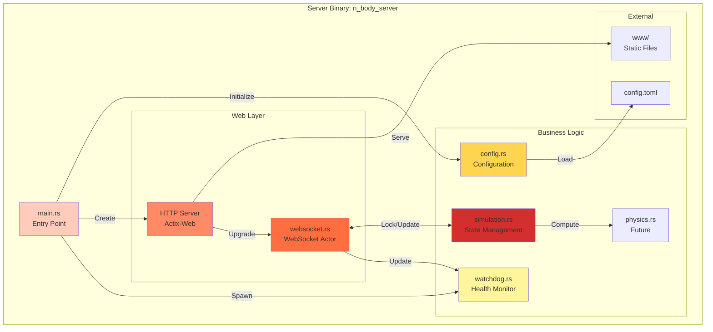

## Module Architecture

### File Structure

```
server/
├── src/
│   ├── main.rs           # Application entry point, HTTP server setup
│   ├── config.rs         # Configuration loading and validation
│   ├── simulation.rs     # Simulation state and physics orchestration
│   ├── physics.rs        # Physics computations (placeholder/future)
│   ├── websocket.rs      # WebSocket actor implementation
│   └── watchdog.rs       # Health monitoring thread
├── Cargo.toml            # Dependencies and build configuration
└── pkg/                  # WASM output directory (generated)
```

### Module Dependencies

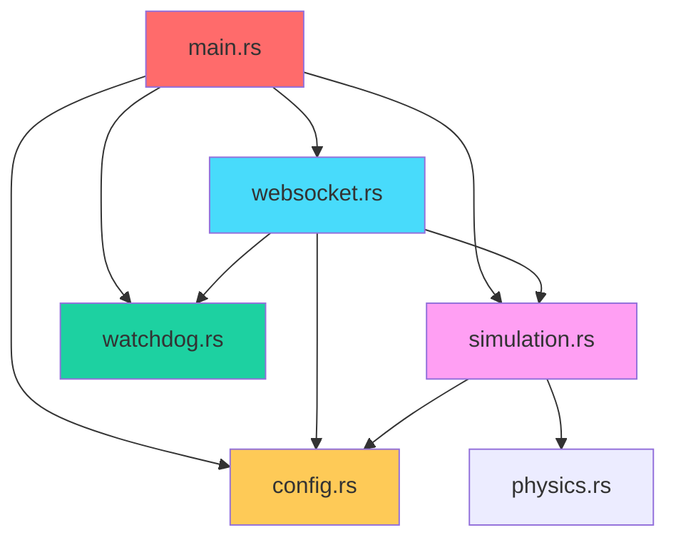

## Core Modules

### main.rs - Application Entry Point

**Purpose**: Initialize the server, configure threading, and start the HTTP server.

**Key Responsibilities:**
- Load configuration from `config.toml`
- Initialize Rayon thread pool
- Create shared simulation state (`Arc<Mutex<Simulation>>`)
- Start watchdog monitoring thread
- Configure and start Actix-Web HTTP server

**Code Structure:**

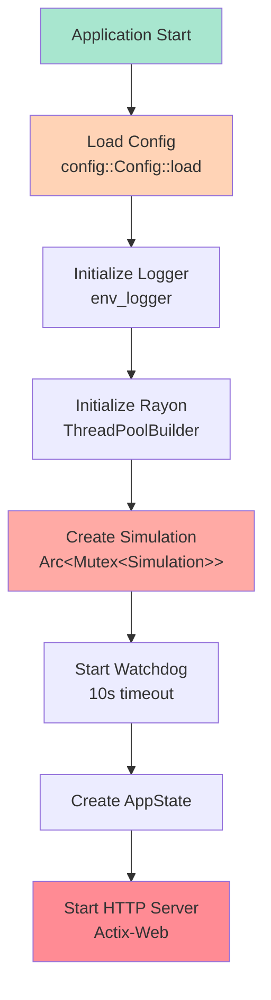

**Key Code Sections:**

| Section | Purpose | Location |
|---------|---------|----------|
| Configuration | Load `config.toml` | Line 52 |
| Rayon Init | Configure thread pool | Lines 64-68 |
| Simulation Init | Create shared state | Lines 70-73 |
| Watchdog | Start monitoring | Lines 76-78 |
| HTTP Server | Bind and serve | Lines 93-111 |

**Routes:**

```rust
App::new()
    .route("/", web::get().to(index))           // Serve index.html
    .route("/ws", web::get().to(ws_index))      // WebSocket endpoint
    .service(actix_files::Files::new("/", "www")) // Static files
```

---

### config.rs - Configuration Management

**Purpose**: Load, validate, and provide configuration for all server components.

**Configuration Structure:**

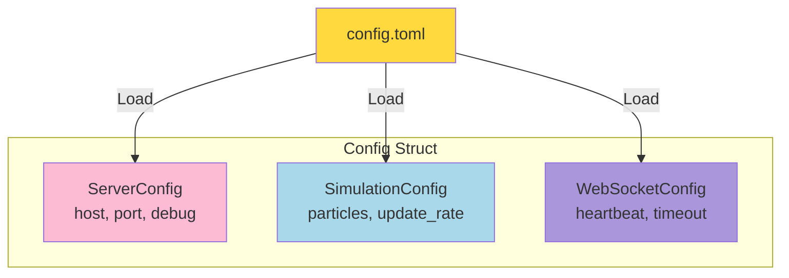

**Configuration Fields:**

```rust
pub struct Config {
    pub server: ServerConfig,
    pub simulation: SimulationConfig,
    pub websocket: WebSocketConfig,
}

pub struct ServerConfig {
    pub host: String,              // Default: "127.0.0.1"
    pub port: u16,                 // Default: 4000
    pub debug: bool,               // Default: false
}

pub struct SimulationConfig {
    pub default_particles: usize,  // Default: 3000
    pub update_rate_ms: u64,       // Default: 16 (60 FPS)
}

pub struct WebSocketConfig {
    pub heartbeat_interval_sec: u64,  // Default: 5
    pub client_timeout_sec: u64,      // Default: 10
}
```

**Default Values:**

| Setting | Default | Range |
|---------|---------|-------|
| `server.host` | "127.0.0.1" | Any valid IP |
| `server.port` | 4000 | 1024-65535 |
| `server.debug` | false | true/false |
| `simulation.default_particles` | 3000 | 1-15000 |
| `simulation.update_rate_ms` | 16 | 1-1000 |
| `websocket.heartbeat_interval_sec` | 5 | 1-60 |
| `websocket.client_timeout_sec` | 10 | 2-120 |

**Auto-generation**: If `config.toml` doesn't exist, default values are written to disk.

---

### simulation.rs - Simulation State Management

**Purpose**: Manage simulation state, orchestrate physics updates, and handle configuration changes.

**State Diagram:**

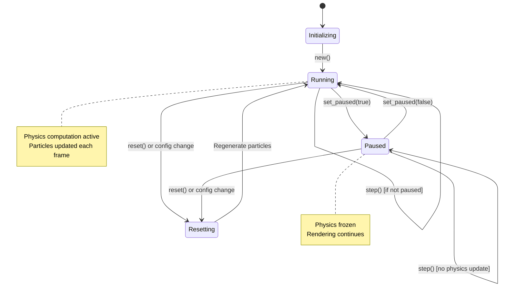

**Core Data Structure:**

```rust
pub struct Simulation {
    particles: Vec<Particle>,           // Current particle state
    config: SimulationConfig,           // Simulation parameters
    sim_time: f32,                      // Elapsed simulation time
    frame_number: u64,                  // Sequential frame counter
    is_paused: bool,                    // Pause state
    last_computation_time: f32,         // Last frame time (ms)
    consecutive_slow_frames: u32,       // Performance monitoring
}
```

**Key Methods:**

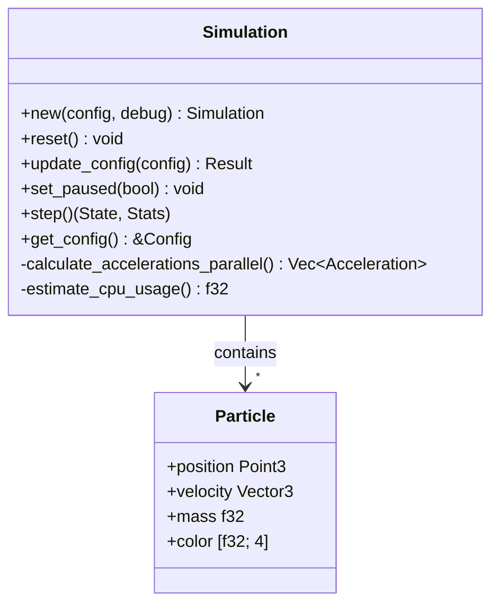

**step() Method Flow:**

```mermaid
graph TB
    Start[step called]
    CheckPaused{is_paused?}
    CalcAccel[calculate_accelerations_parallel<br/>O(n²) Rayon parallel]
    UpdateParticles[Update particles<br/>Parallel with Rayon]
    IncrementTime[Increment sim_time,<br/>frame_number]
    CalcStats[Calculate Stats]
    CheckPerf{Computation time<br/>> 200ms?}
    LogWarning[Log performance warning]
    Return[Return State, Stats]

    Start --> CheckPaused
    CheckPaused -->|Not Paused| CalcAccel
    CheckPaused -->|Paused| CalcStats
    CalcAccel --> UpdateParticles
    UpdateParticles --> IncrementTime
    IncrementTime --> CalcStats
    CalcStats --> CheckPerf
    CheckPerf -->|Yes| LogWarning
    CheckPerf -->|No| Return
    LogWarning --> Return

    style Start fill:#a8e6cf
    style CalcAccel fill:#ff6b6b
    style UpdateParticles fill:#ff8787
    style CheckPerf fill:#feca57
    style LogWarning fill:#ff9ff3
    style Return fill:#48dbfb
```

**Physics Update (Parallel):**

```rust
// Calculate accelerations in parallel using Rayon
let accelerations = self.calculate_accelerations_parallel();

// Update particles in parallel
self.particles
    .par_iter_mut()
    .zip(accelerations.par_iter())
    .for_each(|(particle, &acceleration)| {
        particle.velocity += acceleration * self.config.time_step;
        particle.position += particle.velocity * self.config.time_step;
    });
```

**Performance Monitoring:**

The simulation tracks computation time and logs warnings:
- **Single slow frame** (>200ms): Log warning with particle count
- **10 consecutive slow frames**: Log error, suggest reducing particles
- **Automatic**: Counter resets when performance improves

---

### websocket.rs - WebSocket Actor

**Purpose**: Handle WebSocket connections, manage message exchange, and drive simulation updates.

**Actor Architecture:**

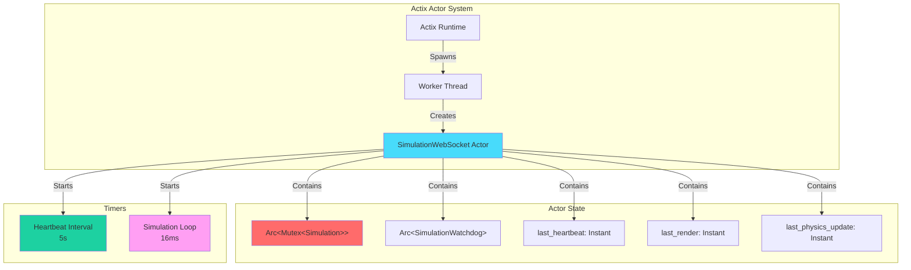

**Lifecycle Hooks:**

```mermaid
sequenceDiagram
    participant Actix as Actix Runtime
    participant Actor as SimulationWebSocket
    participant Client as WebSocket Client

    Actix->>Actor: Create actor
    Actix->>Actor: started(&mut ctx)

    activate Actor
    Actor->>Actor: start_heartbeat(ctx)
    Actor->>Actor: start_simulation_loop(ctx)
    Actor->>Actor: Send initial config
    Actor->>Client: ServerMessage::Config
    deactivate Actor

    Note over Actor,Client: Actor running...

    Actix->>Actor: stopped(&mut ctx)
    activate Actor
    Note over Actor: Cleanup resources
    deactivate Actor
```

**Simulation Loop Timer:**

```mermaid
sequenceDiagram
    participant Timer as Interval Timer
    participant Actor as WebSocket Actor
    participant Sim as Simulation
    participant Client

    loop Every 16ms
        Timer->>Actor: Trigger
        Actor->>Actor: Check elapsed time
        Actor->>Sim: lock().step()
        Sim-->>Actor: (State, Stats)
        Actor->>Actor: Update watchdog

        alt Visual FPS interval (33ms for 30 FPS)
            Actor->>Actor: Serialize State
            Actor->>Client: Send State JSON
        end

        alt Every 30 frames
            Actor->>Actor: Serialize Stats
            Actor->>Client: Send Stats JSON
        end
    end
```

**Message Handling:**

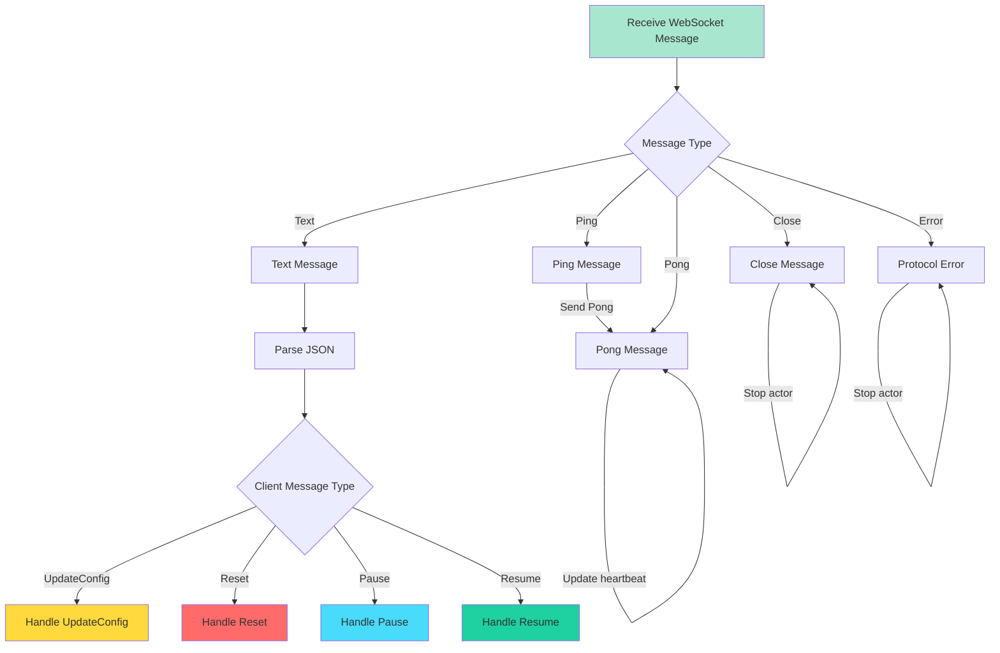

**Key Features:**

1. **Heartbeat Management**: Ping/Pong every 5s, timeout after 10s
2. **Visual FPS Throttling**: Only send State updates at configured FPS
3. **Stats Throttling**: Send Stats every 30 frames to reduce traffic
4. **Error Handling**: Send Error messages back to client
5. **Graceful Shutdown**: Stop actor on close or error

---

### watchdog.rs - Health Monitoring

**Purpose**: Monitor simulation for hangs or performance issues.

**Architecture:**

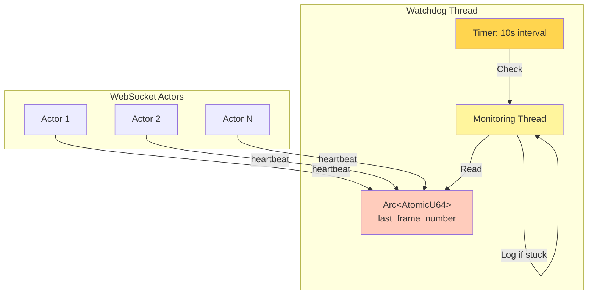

**Detection Logic:**

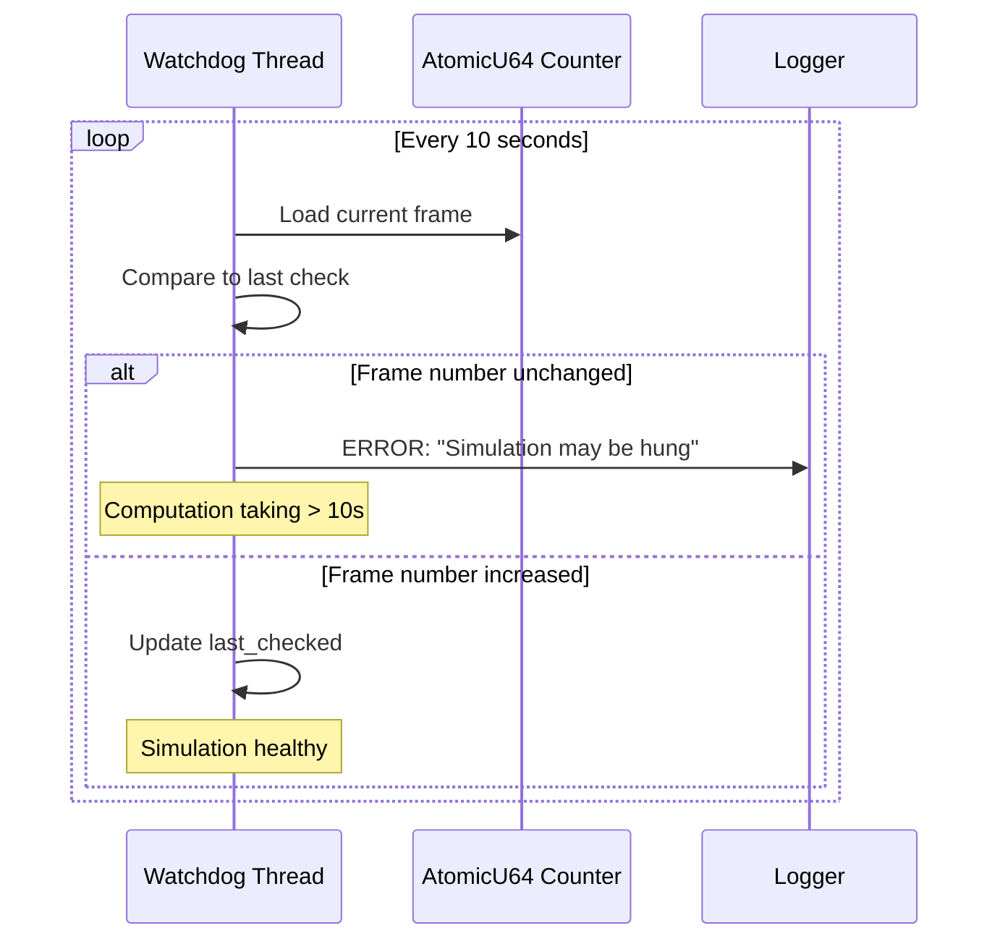

**Use Cases:**

| Scenario | Detection | Action |
|----------|-----------|--------|
| **Too many particles** | Frame updates stop | Log error after 10s |
| **Deadlock** | Frame counter frozen | Log error after 10s |
| **Infinite loop** | No frame progression | Log error after 10s |
| **Normal operation** | Frame counter increments | No action |

---

## Threading and Concurrency

### Thread Architecture

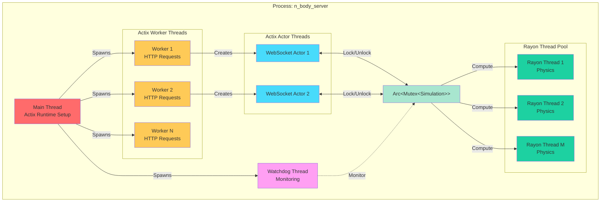

### Concurrency Model

**Lock-Based Synchronization:**

```rust
// Shared simulation state
let simulation = Arc::new(Mutex::new(Simulation::new(&config, debug)));

// WebSocket actor locks for updates
match self.simulation.lock() {
    Ok(mut sim) => {
        let (state, stats) = sim.step();
        // ... send to client
    }
    Err(e) => error!("Failed to lock: {}", e),
}
```

**Parallel Physics with Rayon:**

```rust
// Outer loop parallelized across CPU cores
(0..n)
    .into_par_iter()  // Rayon parallel iterator
    .map(|i| {
        // Calculate acceleration for particle i
        // Inner loop sequential but many i computed in parallel
    })
    .collect()
```

### Lock Contention

**Potential Bottlenecks:**

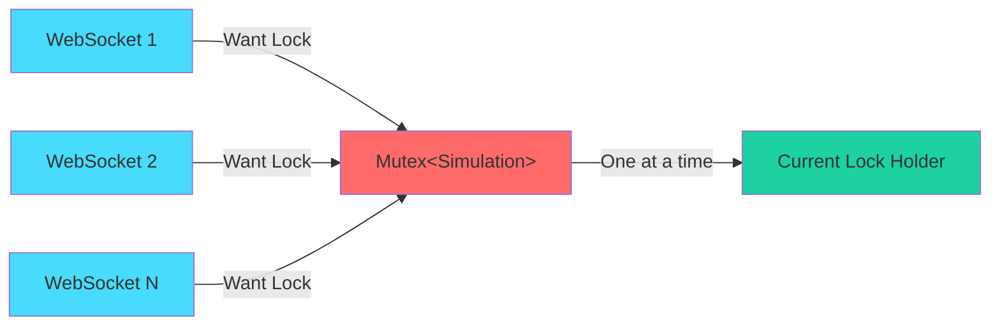

**Mitigation Strategies:**

1. **Short Critical Sections**: Lock held only during `step()` call
2. **Single Writer Pattern**: Typically one active WebSocket per client
3. **Read-After-Write**: No read-only lock mode (could use RwLock)
4. **Fast Physics**: Rayon parallelism keeps lock time low

---

## Performance Optimizations

### Parallel Physics Computation

**Algorithm: O(n²) All-Pairs Force Calculation**

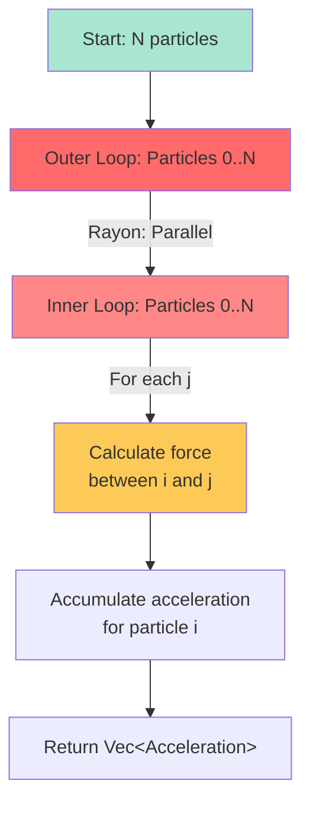

**Speedup with Rayon:**

| Cores | Sequential Time | Parallel Time | Speedup |
|-------|----------------|---------------|---------|
| 1 | 100ms | 100ms | 1.0× |
| 4 | 100ms | ~27ms | 3.7× |
| 8 | 100ms | ~14ms | 7.1× |
| 16 | 100ms | ~8ms | 12.5× |

*Note: Speedup varies based on particle count and CPU architecture.*

### Visual FPS Throttling

**Problem**: At high particle counts, sending 60 State updates/second wastes bandwidth.

**Solution**: `visual_fps` setting controls render update rate independently of physics rate.

```rust
// Physics updates: Every 16ms (60 FPS)
// Visual updates: Based on visual_fps (default 30 FPS = 33ms)

let render_interval_ms = 1000 / visual_fps;

if act.last_render.elapsed().as_millis() >= render_interval_ms as u128 {
    act.last_render = Instant::now();
    ctx.text(json);  // Send State update
}
```

**Bandwidth Savings:**

| Visual FPS | Messages/sec | Bandwidth (5K particles) |
|------------|--------------|--------------------------|
| 60 | 60 | ~15 MB/s |
| 30 | 30 | ~7.5 MB/s |
| 15 | 15 | ~3.75 MB/s |

### Particle Limits

**Safety Mechanism:**

```rust
pub const MAX_PARTICLES: usize = 15_000;
pub const MAX_COMPUTATION_TIME_MS: f32 = 200.0;

// In update_config:
if config.particle_count > MAX_PARTICLES {
    return Err(format!(
        "Particle count {} exceeds maximum of {}...",
        config.particle_count, MAX_PARTICLES
    ));
}
```

**Why 15,000?**

- **15,000 particles** = 225 million force calculations per frame
- Target: < 100ms computation time on modern CPUs
- Leaves headroom for UI responsiveness

### State Cloning

**Current Approach:**

```rust
let state = SimulationState {
    particles: self.particles.clone(),  // Full clone every frame
    sim_time: self.sim_time,
    frame_number: self.frame_number,
};
```

**Cost:** O(n) memory allocation and copy per frame.

**Potential Optimizations:**
1. Use `Arc<Vec<Particle>>` to avoid clone
2. Implement delta updates (send only changed particles)
3. Use double buffering pattern

---

## Related Pages

- **[Architecture Overview](Architecture)** - High-level system design
- **[Communication Protocol](Communication-Protocol)** - WebSocket protocol details
- **[Client Components](Client-Components)** - WASM client architecture
- **[Performance Tuning](Performance-Tuning)** - Optimization guide

---

[← Back to Home](Home)
