# Shared Library

Documentation for the `shared` crate containing common data structures and message types used by both client and server.

## Table of Contents
- [Overview](#overview)
- [Data Structures](#data-structures)
- [Message Types](#message-types)
- [Constants](#constants)

## Overview

The `shared` crate provides common types that must be identical between client and server:

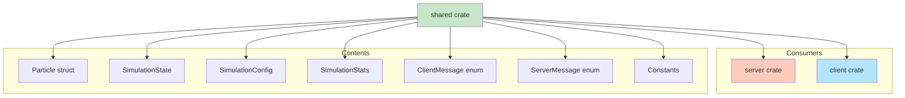

## Data Structures

### Particle

Represents a single particle in the simulation.

```rust
#[derive(Clone, Debug, Serialize, Deserialize)]
pub struct Particle {
    pub position: Point3<f32>,
    pub velocity: Vector3<f32>,
    pub mass: f32,
    pub color: [f32; 4],
}
```

**Fields:**

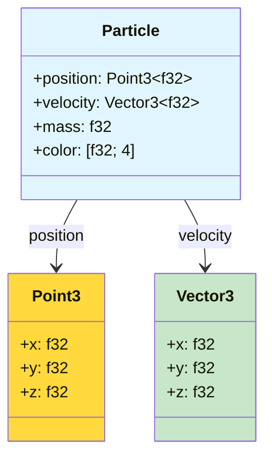

| Field | Type | Purpose | Units |
|-------|------|---------|-------|
| `position` | `Point3<f32>` | 3D world position | World units |
| `velocity` | `Vector3<f32>` | 3D velocity vector | Units/second |
| `mass` | `f32` | Gravitational mass | Arbitrary units |
| `color` | `[f32; 4]` | RGBA color | 0.0-1.0 per channel |

**Usage Example:**

```rust
let particle = Particle {
    position: Point3::new(1.0, 2.0, 3.0),
    velocity: Vector3::new(0.1, -0.2, 0.0),
    mass: 1.5,
    color: [0.8, 0.8, 1.0, 1.0],  // Light blue
};
```

---

### SimulationState

Complete state of the simulation at a point in time.

```rust
#[derive(Serialize, Deserialize, Debug)]
pub struct SimulationState {
    pub particles: Vec<Particle>,
    pub sim_time: f32,
    pub frame_number: u64,
}
```

**State Diagram:**

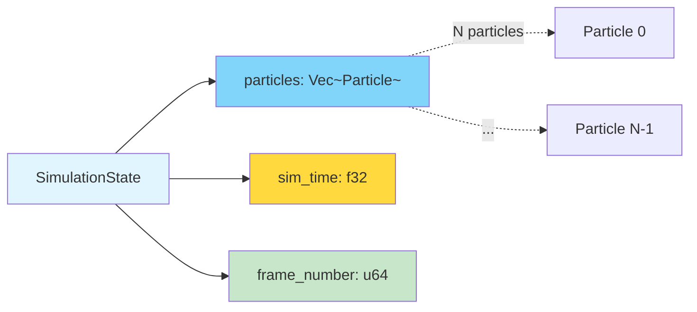

**Fields:**

| Field | Type | Purpose |
|-------|------|---------|
| `particles` | `Vec<Particle>` | All particles in simulation |
| `sim_time` | `f32` | Elapsed simulation time (seconds) |
| `frame_number` | `u64` | Sequential frame counter |

**Size Calculation:**

```
Size ≈ particles.len() × sizeof(Particle) + 12 bytes

For 5000 particles:
- Particle: ~40 bytes (position=12, velocity=12, mass=4, color=16)
- Total: 5000 × 40 = ~200 KB per State message
```

---

### SimulationConfig

Configuration parameters for the simulation.

```rust
#[derive(Clone, Serialize, Deserialize, Debug)]
pub struct SimulationConfig {
    pub particle_count: usize,
    pub time_step: f32,
    pub gravity_strength: f32,
    pub visual_fps: u32,
    pub zoom_level: f32,
    #[serde(default)]
    pub debug: bool,
}
```

**Configuration Flow:**

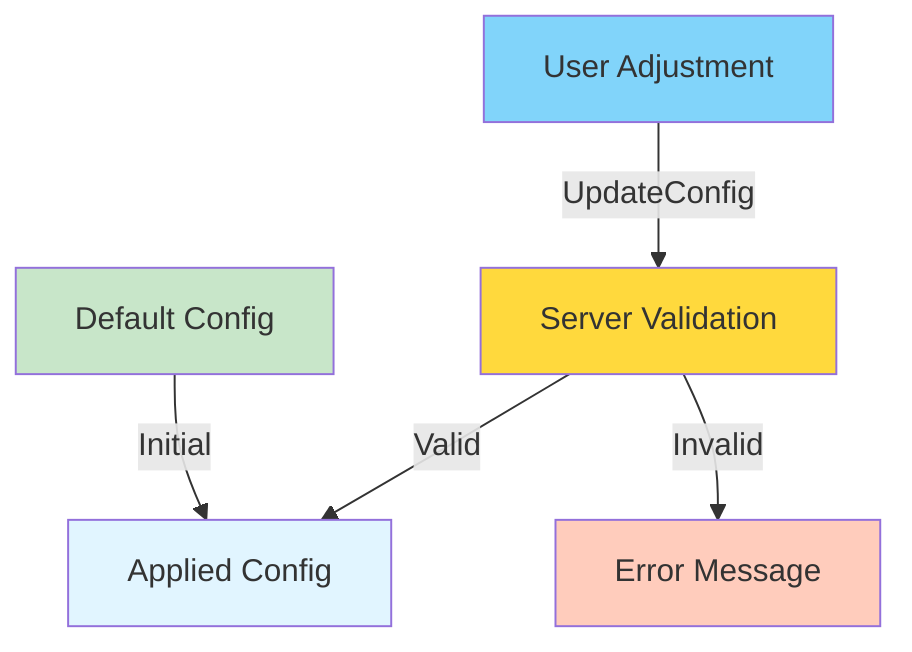

**Fields:**

| Field | Type | Default | Range | Effect |
|-------|------|---------|-------|--------|
| `particle_count` | `usize` | 3000 | 1-15000 | Number of particles |
| `time_step` | `f32` | 0.01 | 0.001-0.1 | Physics delta time |
| `gravity_strength` | `f32` | 1.0 | 0.1-10.0 | Gravity multiplier |
| `visual_fps` | `u32` | 30 | 1-60 | Render update rate |
| `zoom_level` | `f32` | 1.0 | 0.1-10.0 | Camera zoom |
| `debug` | `bool` | false | true/false | Enable debug logging |

**Validation Rules:**

```rust
// Server-side validation (simulation.rs)
if config.particle_count > MAX_PARTICLES {
    return Err(format!(
        "Particle count {} exceeds maximum of {}",
        config.particle_count, MAX_PARTICLES
    ));
}
```

---

### SimulationStats

Performance and runtime statistics.

```rust
#[derive(Serialize, Deserialize, Debug)]
pub struct SimulationStats {
    pub fps: f32,
    pub computation_time_ms: f32,
    pub particle_count: usize,
    pub sim_time: f32,
    pub cpu_usage: f32,
    pub frame_number: u64,
}
```

**Stats Dashboard:**

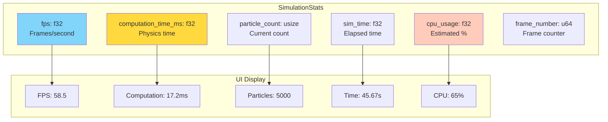

**Fields:**

| Field | Type | Meaning | Typical Range |
|-------|------|---------|---------------|
| `fps` | `f32` | Physics frames per second | 30-60 |
| `computation_time_ms` | `f32` | Time to compute one frame | 5-200 ms |
| `particle_count` | `usize` | Current particle count | 1-15000 |
| `sim_time` | `f32` | Simulation elapsed time | 0-∞ |
| `cpu_usage` | `f32` | Estimated CPU usage | 0-100 % |
| `frame_number` | `u64` | Sequential frame ID | 0-∞ |

---

## Message Types

### ClientMessage

Messages sent from client to server.

```rust
#[derive(Serialize, Deserialize, Debug)]
#[serde(tag = "type")]
pub enum ClientMessage {
    UpdateConfig(SimulationConfig),
    Reset,
    Pause,
    Resume,
}
```

**Message Type Diagram:**

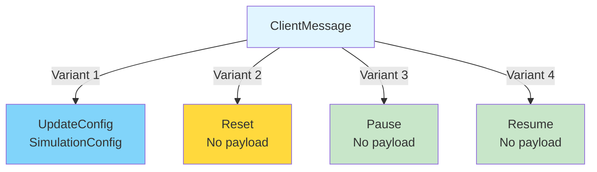

**JSON Examples:**

```json
// UpdateConfig
{
  "type": "UpdateConfig",
  "particle_count": 5000,
  "time_step": 0.01,
  "gravity_strength": 1.0,
  "visual_fps": 30,
  "zoom_level": 1.0,
  "debug": false
}

// Reset
{
  "type": "Reset"
}

// Pause
{
  "type": "Pause"
}

// Resume
{
  "type": "Resume"
}
```

---

### ServerMessage

Messages sent from server to client.

```rust
#[derive(Serialize, Deserialize, Debug)]
#[serde(tag = "type")]
pub enum ServerMessage {
    State(SimulationState),
    Stats(SimulationStats),
    Config(SimulationConfig),
    Error { message: String },
}
```

**Message Frequency:**

```mermaid
gantt
    title Server Message Timeline (1 second)
    dateFormat X
    axisFormat %L

    section State
    Frame 0  :0, 33
    Frame 1  :33, 66
    Frame 2  :66, 99
    ...30 frames :99, 1000

    section Stats
    Stats update :1000, 1050

    section Config
    On demand :crit, 0, 50
```

**Message Flow:**

| Message | Frequency | Trigger |
|---------|-----------|---------|
| `State` | visual_fps (default 30/s) | Simulation step |
| `Stats` | Every 30 frames (~1/s) | Frame counter |
| `Config` | On demand | Connection, config change |
| `Error` | On demand | Validation failure, error |

---

## Constants

### MAX_PARTICLES

Maximum allowed particle count to prevent server overload.

```rust
pub const MAX_PARTICLES: usize = 15_000;
```

**Rationale:**

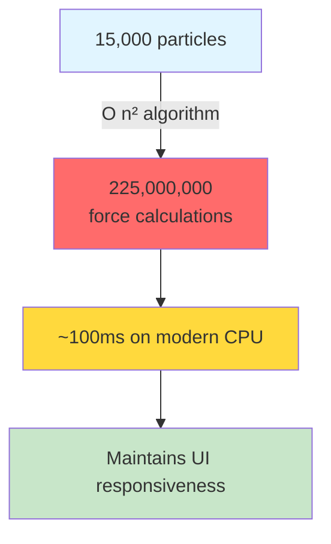

**Calculation:**

```
15,000 particles × 15,000 particles = 225,000,000 force calculations per frame

At 60 FPS: 13.5 billion calculations per second

Modern CPU (8 cores, 3 GHz):
- ~100ms per frame with Rayon parallelization
- Allows for responsive UI at 30 FPS
```

---

### MAX_COMPUTATION_TIME_MS

Warning threshold for physics computation time.

```rust
pub const MAX_COMPUTATION_TIME_MS: f32 = 200.0;
```

**Purpose:** Log warnings when single-frame computation exceeds 200ms.

**Monitoring:**

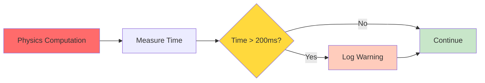

---

## Serialization

All shared types use **serde** for JSON serialization:

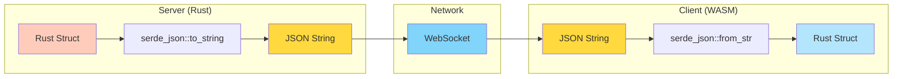

**Example:**

```rust
// Server: Rust → JSON
let state = SimulationState { /* ... */ };
let json = serde_json::to_string(&ServerMessage::State(state))?;
ws.send(json);

// Client: JSON → Rust
let msg: ServerMessage = serde_json::from_str(&json)?;
match msg {
    ServerMessage::State(state) => { /* ... */ }
    // ...
}
```

---

## Dependencies

The `shared` crate has minimal dependencies:

```toml
[dependencies]
nalgebra = "0.32"
serde = { version = "1.0", features = ["derive"] }
```

**Why nalgebra?**

- Provides `Point3` and `Vector3` types
- Efficient linear algebra operations
- Compatible with both native and WASM targets

**Why serde?**

- Industry-standard serialization
- Automatic derive macros
- JSON support via `serde_json`

---

## Version Compatibility

**Critical:** Client and server must use **identical** `shared` crate version.

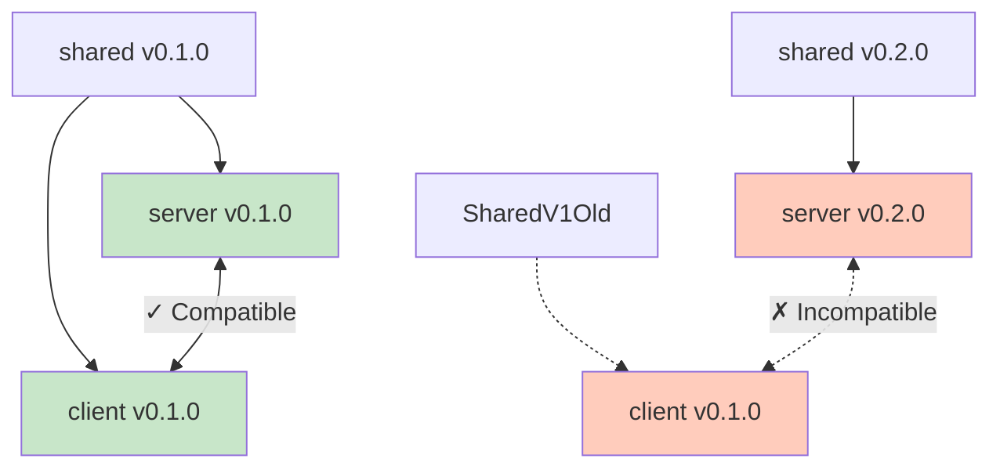

**Breaking Changes:**

Changes that require version bump:

- Adding/removing fields from structs
- Changing field types
- Adding/removing message variants
- Changing serialization format

**Safe Changes:**

Changes that maintain compatibility:

- Adding `#[serde(default)]` fields
- Changing constants
- Adding new message types (if handled gracefully)

---

## Related Pages

- **[Communication Protocol](Communication-Protocol)** - How messages are used
- **[Server Components](Server-Components)** - Server usage
- **[Client Components](Client-Components)** - Client usage
- **[Architecture Overview](Architecture)** - System design

---

[← Back to Home](Home)
